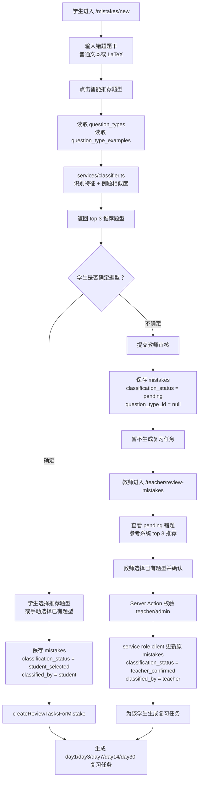

# 项目架构总览

## 项目目标

江苏专转本数学错题复盘系统。

当前 MVP 目标是跑通以下闭环：

1. 教师或管理员维护数学题型库。
2. 学生手动录入错题，支持普通文本和 LaTeX。
3. 系统基于题型识别特征和代表例题相似度推荐 top 3 题型。
4. 学生可自行确认题型，也可提交教师审核。
5. 错题最终确认题型后生成复习任务。
6. 学生在今日复习页完成周期复习。

## 技术栈

- Next.js App Router
- TypeScript
- Tailwind CSS
- Supabase
  - Auth
  - Postgres
  - Row Level Security
- KaTeX，用于 LaTeX 渲染

---

# 目录结构

根据当前仓库扫描，核心目录如下：

```text
app/
components/
lib/
services/
supabase/
docs/
```

## `app/`

Next.js App Router 页面、布局和 Server Actions。

当前主要结构：

```text
app/
  page.tsx
  layout.tsx
  globals.css
  (auth)/
    actions.ts
    login/page.tsx
    register/page.tsx
  (app)/
    layout.tsx
    actions.ts
    dashboard/page.tsx
    question-types/page.tsx
    question-types/actions.ts
    mistakes/page.tsx
    mistakes/actions.ts
    mistakes/new/page.tsx
    mistakes/new/mistake-entry-form.tsx
    teacher/dashboard/page.tsx
    teacher/review-mistakes/page.tsx
    teacher/review-mistakes/actions.ts
    teacher/problems/new/page.tsx
    teacher/problems/new/actions.ts
    teacher/problems/new/problem-form.tsx
    teacher/problems/page.tsx
    teacher/problems/actions.ts
    teacher/problems/copy-latex-button.tsx
    reviews/page.tsx
    reviews/actions.ts
    reviews/today/page.tsx
    weak-practice/page.tsx
    weak-practice/actions.ts
```

职责：

- `app/page.tsx`：公开首页。
- `app/(auth)`：登录和注册入口控制。
- `app/(app)`：登录后的业务页面。
- `app/(app)/layout.tsx`：登录态保护、角色导航、退出登录。
- 各模块 `actions.ts`：Server Actions，处理登录、题型保存、错题保存、审核、复习任务完成等。

## `components/`

共享 UI 组件。

当前文件：

```text
components/latex-preview.tsx
components/problems/LatexProblemRenderer.tsx
```

职责：

- 使用 KaTeX 渲染 LaTeX 内容。
- 被错题录入、错题库、教师审核、今日复习页面复用。
- `LatexProblemRenderer` 识别 `\blankbox` 和 `\fourchoices{A}{B}{C}{D}`，用于原生 LaTeX 题目预览与展示。
- 所有题目展示统一使用 `LatexProblemRenderer`；标准 `$...$`、`$$...$$`、`\(...\)`、`\[...\]` 公式继续交给 KaTeX。
- `\blankbox` 渲染为 `（　　　）`。
- 文本模式下的 `\_\_\_` 或 3 个以上连续下划线渲染为填空横线，不处理数学公式内部下标。
- `\fourchoices` 会先从题干中移除，再渲染为 A/B/C/D 选项区。

## `lib/`

基础设施与共享工具。

当前主要文件：

```text
lib/env.ts
lib/roles.ts
lib/supabase/browser.ts
lib/supabase/server.ts
lib/supabase/middleware.ts
lib/supabase/admin.ts
```

职责：

- `env.ts`：读取 Supabase 环境变量。
- `roles.ts`：角色类型和权限判断。
- `supabase/browser.ts`：客户端 Supabase browser client。
- `supabase/server.ts`：Server Component / Server Action 使用的 Supabase server client。
- `supabase/middleware.ts`：刷新 Supabase session cookies。
- `supabase/admin.ts`：service role admin client，仅服务端使用。

## `services/`

业务服务层，后续替换 AI / OCR 时优先扩展这里。

当前文件：

```text
services/classifier.ts
services/latex.ts
services/latex-normalizer.ts
services/latex-exporter.ts
services/weak-practice.ts
```

职责：

- `classifier.ts`：题型推荐服务。
- `latex.ts`：LaTeX 文本清洗，用于分类前提取纯文本。
- `latex-normalizer.ts`：清洗教师原生 LaTeX，提取分类文本和选择题选项。
- `latex-exporter.ts`：导出时优先原样返回 `raw_latex`。

## `supabase/`

Supabase migration 文件。

当前迁移：

```text
supabase/migrations/202606090001_initial_schema.sql
supabase/migrations/202606090002_add_latex_fields_to_mistakes.sql
supabase/migrations/202606090003_add_roles_and_question_type_permissions.sql
supabase/migrations/202606090004_add_mistake_review_flow.sql
supabase/migrations/202606090005_fix_teacher_review_rls.sql
supabase/migrations/202606090006_combine_mistakes_update_policy.sql
supabase/migrations/202606090007_review_tasks_module.sql
supabase/migrations/202606090008_add_knowledge_mastery_dashboard.sql
supabase/migrations/202606090009_add_native_latex_problems.sql
supabase/migrations/202606090010_fix_problems_table_and_dashboard.sql
supabase/migrations/202606100001_add_weak_practice_tasks.sql
```

职责：

- 保存数据库结构演进记录。
- 后续支持 Supabase CLI 本地化开发。
- 线上已有库应按 migration 顺序增量执行，不应随意重跑完整 schema。

## `docs/`

项目文档与 SQL schema。

当前主要文件：

```text
docs/supabase-schema.sql
docs/PROJECT_CONTEXT.md
docs/PRODUCT_REQUIREMENTS.md
docs/ROADMAP.md
docs/ARCHITECTURE.md
```

职责：

- `supabase-schema.sql`：完整数据库 schema 和 RLS 策略。
- 其他 Markdown：项目上下文、需求、路线图和架构说明。

---

# 页面架构

## `/`

文件：`app/page.tsx`

页面作用：

- 公开首页。
- 展示系统名称和 MVP 能力简介。
- 只提供登录入口。

访问权限：

- 公开访问。

使用的 Server Actions：

- 无。

## `/login`

文件：`app/(auth)/login/page.tsx`

页面作用：

- 邮箱密码登录。
- 登录成功后根据角色跳转：
  - `admin` / `teacher`：`/question-types`
  - `student`：`/mistakes/new`

访问权限：

- 公开访问。

使用的 Server Actions：

- `app/(auth)/actions.ts`
  - `signIn(formData)`

备注：

- 当前页面仍显示“去注册”链接。
- `/register` 实际会重定向回 `/login` 并提示系统不开放自主注册。

## `/register`

文件：`app/(auth)/register/page.tsx`

页面作用：

- 阻止前台自主注册。
- 直接重定向到登录页并显示提示。

访问权限：

- 公开访问，但不可注册。

使用的 Server Actions：

- 无。

## `/dashboard`

文件：`app/(app)/dashboard/page.tsx`

页面作用：

- 登录后工作台占位页。

访问权限：

- 需要登录。
- 登录保护由 `app/(app)/layout.tsx` 完成。
- 学生看到学习仪表盘。
- `teacher` / `admin` 访问时显示教师基础统计。

学生仪表盘实时读取 `review_tasks` 和关联的 `question_types`，不依赖 `knowledge_mastery` 缓存表。当前包含：

- 今日待复习
- 今日已完成
- 完成率
- 连续学习天数
- 你的薄弱题型 TOP5
- 知识点掌握度
- 最近复习记录
- 最近 30 天复习结果时间轴

使用的 Server Actions：

- 无。

## `/teacher/dashboard`

文件：`app/(app)/teacher/dashboard/page.tsx`

页面作用：

- 教师仪表盘入口。
- 复用 `/dashboard` 中的教师基础统计组件。

访问权限：

- 只有 `teacher` / `admin` 可访问。
- 学生访问会重定向到 `/dashboard`。

使用的 Server Actions：

- 无。

## `/question-types`

文件：

- `app/(app)/question-types/page.tsx`
- `app/(app)/question-types/actions.ts`

页面作用：

- 题型库列表页。
- 支持一级分类、二级分类、三级题型级联筛选。
- 支持启用状态筛选和题型 / 识别特征 / 说明 / 例题搜索。
- 支持删除题型。
- 提供跳转到 `/question-types/new` 和 `/question-types/[id]/edit` 的入口。
- 不再承载新增或编辑表单。

访问权限：

- 页面层：只有 `teacher` / `admin` 可访问。
- 学生访问会被重定向到 `/mistakes/new`。
- 数据库层：所有登录用户可读题型库，只有 `teacher` / `admin` 可写。

使用的 Server Actions：

- `deleteQuestionType(formData)`

## `/question-types/new`

文件：

- `app/(app)/question-types/new/page.tsx`
- `components/question-types/QuestionTypeForm.tsx`
- `app/(app)/question-types/actions.ts`

页面作用：

- 专门新增题型。
- 表单字段包括一级分类、二级分类、三级题型、题型说明 / 适用场景、题型识别特征、代表例题和启用状态。
- 代表例题支持 LaTeX 输入、实时预览、添加多道和删除。

访问权限：

- 只有 `teacher` / `admin` 可访问。
- 学生访问会被重定向到 `/dashboard`。

使用的 Server Actions：

- `createQuestionType(formData)`

## `/question-types/[id]/edit`

文件：

- `app/(app)/question-types/[id]/edit/page.tsx`
- `components/question-types/QuestionTypeForm.tsx`
- `app/(app)/question-types/actions.ts`

页面作用：

- 专门编辑单个题型。
- 读取指定 `question_types` 记录和 `question_type_examples`。
- 复用新增页表单，支持修改题型路径、题型说明、识别特征、代表例题和启用状态。

访问权限：

- 只有 `teacher` / `admin` 可访问。
- 学生访问会被重定向到 `/dashboard`。

使用的 Server Actions：

- `updateQuestionType(formData)`
- `deleteQuestionType(formData)`

## `/mistakes`

文件：`app/(app)/mistakes/page.tsx`

页面作用：

- 当前登录学生的错题库。
- 支持按题型筛选。
- 展示普通文本或 LaTeX 错题。
- 展示分类状态、教师备注和复习状态摘要。

访问权限：

- 需要登录。
- 学生只能通过 RLS 看到自己的错题。
- `teacher` / `admin` 在当前页面也会受到 RLS 影响；教师审核另走 `/teacher/review-mistakes`。

使用的 Server Actions：

- 页面本身不提交 Server Action。
- 读取 `mistakes`、`question_types`、`review_tasks`。

## `/mistakes/new`

文件：

- `app/(app)/mistakes/new/page.tsx`
- `app/(app)/mistakes/new/mistake-entry-form.tsx`
- `app/(app)/mistakes/actions.ts`

页面作用：

- 学生录入错题。
- 支持普通文本和 LaTeX。
- LaTeX 实时预览。
- 调用推荐服务返回 top 3 题型。
- 学生可选择推荐题型、手动选择已有题型，或提交教师审核。

访问权限：

- 需要登录。
- 所有角色均可访问，但产品上主要面向学生。

使用的 Server Actions：

- `recommendQuestionTypes({ inputType, rawText, latexContent })`
- `saveMistake(formData)`

## `/teacher/review-mistakes`

文件：

- `app/(app)/teacher/review-mistakes/page.tsx`
- `app/(app)/teacher/review-mistakes/actions.ts`

页面作用：

- 教师审核学生提交的 pending 错题。
- 展示学生题目、学生备注、系统推荐 top 3。
- 教师选择最终题型并可填写教师备注。
- 确认后更新原错题记录并创建复习任务。

访问权限：

- 只有 `teacher` / `admin` 可访问。
- 页面层使用 `getCurrentUserRole()` 和 `canManageQuestionTypes()` 判断。
- 写入层再次校验当前登录用户角色，然后使用 service role client 更新数据。

使用的 Server Actions：

- `confirmMistakeQuestionType(formData)`

## `/teacher/problems/new`

文件：

- `app/(app)/teacher/problems/new/page.tsx`
- `app/(app)/teacher/problems/new/problem-form.tsx`
- `app/(app)/teacher/problems/new/actions.ts`

页面作用：

- 教师录入原生 LaTeX 题目。
- 支持 `single_choice`、`fill_blank`、`calculation` 三类题目。
- 保存 `raw_latex` 原文、来源、答案、解析和关联题型。
- 右侧使用 `LatexProblemRenderer` 实时预览。

访问权限：

- 只有 `teacher` / `admin` 可访问。

使用的 Server Actions：

- `saveProblem(formData)`

## `/teacher/problems`

文件：

- `app/(app)/teacher/problems/page.tsx`
- `app/(app)/teacher/problems/actions.ts`
- `app/(app)/teacher/problems/copy-latex-button.tsx`

页面作用：

- 教师题库列表页。
- 显示已录入题目、题目类型、所属题型和渲染预览。
- 支持查看原始 `raw_latex`。
- 支持复制原始 LaTeX。
- 支持编辑和删除题目。
- 支持按题目类型、一级分类、二级分类、三级题型、来源和关键词筛选。
- 关键词搜索覆盖 `raw_latex` 和 `normalized_text`。
- 与 `/question-types` 分离，题型库页只管理题型，不显示具体题目。

访问权限：

- 只有 `teacher` / `admin` 可访问。

使用的 Server Actions：

- `updateProblem(formData)`
- `deleteProblem(formData)`

## `/reviews`

文件：

- `app/(app)/reviews/page.tsx`
- `app/(app)/reviews/actions.ts`

页面作用：

- 今日复习页。
- 显示 `review_date <= 今天` 且 `status = pending` 的复习任务。
- 显示今日待复习数量和今日已完成数量。
- 学生可点击“已掌握”或“未掌握”。

访问权限：

- 需要登录。
- RLS 限制学生只能读取和更新自己的 `review_tasks`。

使用的 Server Actions：

- `getTodayReviewTasks()`
- `completeReviewTask(formData)`

## `/reviews/today`

文件：`app/(app)/reviews/today/page.tsx`

页面作用：

- 兼容旧路径。
- 直接重定向到 `/reviews`。

访问权限：

- 需要登录。

使用的 Server Actions：

- 无。

---

# 用户角色

角色定义在 `lib/roles.ts` 和 `profiles.role` 字段中。

## `student`

默认角色。

权限：

- 登录系统。
- 录入错题。
- 获取系统推荐题型。
- 选择已有题型并保存错题。
- 提交教师审核。
- 查看和管理自己的错题。
- 查看和完成自己的复习任务。
- 读取题型库。

限制：

- 不能管理题型库。
- 不能审核错题。
- 不能查看其他学生错题和复习任务。
- 导航只显示：仪表盘、录入错题、错题库、今日复习。
- 访问教师页面会重定向到 `/dashboard`。

## `teacher`

教师角色。

权限：

- 拥有学生侧页面能力。
- 管理题型库。
- 查看 pending 错题。
- 审核学生提交的错题。
- 通过服务端 service role client 为学生确认题型并生成复习任务。

限制：

- 当前没有完整学生管理后台。
- 当前没有查看所有学生完整错题库的专门页面。
- 导航只显示：教师仪表盘、题型库、错题审核、教师题库、录入题目。
- 访问学生页面 `/mistakes/new`、`/mistakes`、`/reviews` 会重定向到 `/teacher/dashboard`。

## `admin`

管理员角色。

权限：

- 当前代码中与 `teacher` 基本一致。
- 用于初始化系统、管理题型库、审核错题。
- 可通过 Supabase SQL 调整用户角色。

---

# 数据库架构

数据库结构以 `docs/supabase-schema.sql` 和最新 migrations 为准。

## `profiles`

业务作用：

- 存储 Supabase Auth 用户对应的业务资料和角色。
- 新 auth 用户创建后，通过 `handle_new_user()` trigger 自动写入。

字段：

| 字段 | 类型 | 说明 |
| --- | --- | --- |
| `id` | `uuid` | 主键，外键引用 `auth.users(id)`，级联删除 |
| `email` | `text` | 用户邮箱 |
| `full_name` | `text` | 用户姓名 |
| `role` | `text` | 用户角色，默认 `student` |
| `created_at` | `timestamptz` | 创建时间 |
| `updated_at` | `timestamptz` | 更新时间 |

主键：

- `id`

外键：

- `id -> auth.users(id)`

约束：

- `role in ('admin', 'teacher', 'student')`

## `question_types`

业务作用：

- 题型库主表。
- 错题推荐、手动选择和教师审核都从该表读取题型。

字段：

| 字段 | 类型 | 说明 |
| --- | --- | --- |
| `id` | `uuid` | 主键，默认 `gen_random_uuid()` |
| `level1` | `text` | 一级分类 |
| `level2` | `text` | 二级分类 |
| `level3` | `text` | 三级题型 |
| `keywords` | `text[]` | 题型识别特征。字段名保留为 `keywords` 以兼容既有 schema 和 classifier |
| `description` | `text` | 题型说明 / 适用场景 |
| `is_active` | `boolean` | 是否启用，默认 `true` |
| `created_by` | `uuid` | 创建人，默认 `auth.uid()` |
| `created_at` | `timestamptz` | 创建时间 |
| `updated_at` | `timestamptz` | 更新时间 |

主键：

- `id`

外键：

- `created_by -> auth.users(id)`

约束：

- `(level1, level2, level3)` 唯一。

索引：

- `question_types_path_idx`：`level1, level2, level3`
- `question_types_keywords_idx`：`keywords` GIN 索引

## `question_type_examples`

业务作用：

- 存储每个题型的代表例题，当前支持 LaTeX 源码输入和页面实时预览。
- classifier 使用例题文本计算相似度。

字段：

| 字段 | 类型 | 说明 |
| --- | --- | --- |
| `id` | `uuid` | 主键 |
| `question_type_id` | `uuid` | 所属题型 |
| `example_text` | `text` | 代表例题 LaTeX 源码 |
| `solution_hint` | `text` | 例题提示 / 解题入口 |
| `created_by` | `uuid` | 创建人 |
| `created_at` | `timestamptz` | 创建时间 |
| `updated_at` | `timestamptz` | 更新时间 |

主键：

- `id`

外键：

- `question_type_id -> question_types(id)`，级联删除
- `created_by -> auth.users(id)`

索引：

- `question_type_examples_type_idx`：`question_type_id`

## `problems`

业务作用：

- 教师原生 LaTeX 题库。
- `raw_latex` 原样保存，后续导出直接返回该字段。
- `normalized_text` 用于分类推荐。
- `options_json` 缓存单选题选项。

字段：

| 字段 | 类型 | 说明 |
| --- | --- | --- |
| `id` | `uuid` | 主键 |
| `created_by` | `uuid` | 创建人 |
| `question_type_id` | `uuid` | 关联题型 |
| `problem_type` | `text` | `single_choice` / `fill_blank` / `calculation` |
| `raw_latex` | `text` | 原始 LaTeX |
| `normalized_text` | `text` | 分类用纯文本 |
| `options_json` | `jsonb` | 选择题选项 |
| `answer` | `text` | 答案 |
| `analysis` | `text` | 解析 |
| `source` | `text` | 来源 |
| `created_at` | `timestamptz` | 创建时间 |
| `updated_at` | `timestamptz` | 更新时间 |

主键：

- `id`

外键：

- `created_by -> auth.users(id)`
- `question_type_id -> question_types(id)`

约束：

- `problem_type in ('single_choice', 'fill_blank', 'calculation')`

## `mistakes`

业务作用：

- 存储学生错题。
- 支持学生自行选择题型和教师审核确认题型。
- 只有最终确定题型后才生成复习任务。

字段：

| 字段 | 类型 | 说明 |
| --- | --- | --- |
| `id` | `uuid` | 主键 |
| `user_id` | `uuid` | 错题所属学生，默认 `auth.uid()` |
| `question_type_id` | `uuid` | 最终题型，可为空 |
| `stem` | `text` | 用于分类和兜底展示的题干文本 |
| `problem_type` | `text` | `single_choice` / `fill_blank` / `calculation` |
| `input_type` | `text` | `plain_text` 或 `latex` |
| `raw_text` | `text` | 原始文本或 LaTeX 清洗后的文本 |
| `raw_latex` | `text` | 原始 LaTeX，后续导出优先使用 |
| `normalized_stem` | `text` | 分类用纯文本 |
| `options_json` | `jsonb` | 选择题选项 |
| `latex_content` | `text` | LaTeX 内容 |
| `source` | `text` | 来源，当前页面未重点使用 |
| `note` | `text` | 学生备注 |
| `answer` | `text` | 答案 |
| `analysis` | `text` | 解析 |
| `classification_status` | `text` | 分类状态 |
| `classified_by` | `text` | 分类来源 |
| `teacher_note` | `text` | 教师备注 |
| `status` | `text` | 错题状态 |
| `created_at` | `timestamptz` | 创建时间 |
| `updated_at` | `timestamptz` | 更新时间 |

主键：

- `id`

外键：

- `user_id -> auth.users(id)`
- `question_type_id -> question_types(id)`

约束：

- `input_type in ('plain_text', 'latex')`
- `problem_type in ('single_choice', 'fill_blank', 'calculation')`
- `classification_status in ('pending', 'student_selected', 'teacher_confirmed')`
- `classified_by is null or classified_by in ('student', 'teacher', 'system')`
- `status in ('reviewing', 'mastered', 'archived')`

索引：

- `mistakes_user_created_idx`：`user_id, created_at desc`
- `mistakes_type_idx`：`question_type_id`

## `review_tasks`

业务作用：

- 存储错题复习计划和完成状态。
- 错题最终确定题型后生成初始五轮复习任务。
- 学生未掌握时追加补复习任务。

字段：

| 字段 | 类型 | 说明 |
| --- | --- | --- |
| `id` | `uuid` | 主键 |
| `user_id` | `uuid` | 任务所属学生，默认 `auth.uid()` |
| `mistake_id` | `uuid` | 对应错题 |
| `question_type_id` | `uuid` | 对应题型 |
| `interval_days` | `integer` | 间隔天数 |
| `due_date` | `date` | 到期日期，兼容旧字段语义 |
| `review_date` | `date` | 复习日期 |
| `review_round` | `text` | 复习轮次 |
| `status` | `text` | 任务状态 |
| `result` | `text` | 复习结果 |
| `completed_at` | `timestamptz` | 完成时间 |
| `created_at` | `timestamptz` | 创建时间 |
| `updated_at` | `timestamptz` | 更新时间 |

主键：

- `id`

外键：

- `user_id -> auth.users(id)`
- `mistake_id -> mistakes(id)`，级联删除
- `question_type_id -> question_types(id)`

约束：

- `interval_days in (1, 3, 7, 14, 30)`
- `status in ('pending', 'completed', 'skipped')`
- `result is null or result in ('mastered', 'not_mastered')`
- `review_round in ('day1', 'day3', 'day7', 'day14', 'day30', 'retry_day3', 'retry_day7')`

索引：

- `review_tasks_user_due_idx`：`user_id, due_date, status`
- `review_tasks_user_review_idx`：`user_id, review_date, status`
- `review_tasks_mistake_idx`：`mistake_id`

---

# RLS 权限设计

RLS 在以下表启用：

- `profiles`
- `question_types`
- `question_type_examples`
- `problems`
- `mistakes`
- `review_tasks`
- `review_records`

辅助函数：

- `public.current_user_can_manage_question_types()`
  - 查询当前用户 `profiles.role`
  - `role in ('admin', 'teacher')` 时返回 true

## 学生可访问什么

学生：

- 可读取自己的 `profiles`。
- 可读取所有 `question_types` 和 `question_type_examples`。
- 可读取教师录入的 `problems`。
- 可插入自己的 `mistakes`。
- 可查询、更新、删除自己的 `mistakes`。
- 可查询、插入、更新、删除自己的 `review_tasks`。
- 可查询、插入、更新、删除自己的 `review_records`。

业务效果：

- 学生看不到其他学生错题。
- 学生看不到其他学生复习任务。
- 学生不能改题型库。
- 学生不能审核 pending 错题。

## 教师可访问什么

教师：

- 可读取所有题型和例题。
- 可新增、编辑、删除题型和例题。
- 可读取自己的学生侧数据。
- 可读取 `classification_status = 'pending'` 的错题，用于审核页。
- 教师审核写入不依赖普通 RLS update，而是在 Server Action 中校验角色后使用 service role client 更新。

业务效果：

- 教师可以审核学生提交的 pending 错题。
- 教师确认后可为该学生创建复习任务。
- 当前没有教师查看全部学生完整错题库的页面。

## admin 可访问什么

admin：

- 当前应用代码中与 teacher 权限基本一致。
- 可管理题型库。
- 可访问教师审核页。
- 可审核 pending 错题。

## `question_types`

RLS 策略：

- `select`：所有登录用户可读。
- `insert`：`teacher` / `admin`。
- `update`：`teacher` / `admin`。
- `delete`：`teacher` / `admin`。

## `mistakes`

RLS 策略：

- `select`：
  - 自己的错题：`user_id = auth.uid()`。
  - 或 `teacher` / `admin` 读取 pending 错题。
- `insert`：
  - 只能插入自己的错题。
- `update`：
  - 学生可更新自己的错题。
  - RLS 中也保留了教师审核后的 `teacher_confirmed` 条件。
  - 实际教师审核写入走 service role client，更稳。
- `delete`：
  - 只能删除自己的错题。

## `review_tasks`

RLS 策略：

- `select`：只能读取自己的任务。
- `insert`：
  - 自己可插入自己的任务。
  - `teacher` / `admin` 也可通过策略插入；实际教师审核流程使用 service role client。
- `update`：只能更新自己的任务。
- `delete`：只能删除自己的任务。

## `problems`

RLS 策略：

- `select`：所有登录用户可读。
- `insert`：`teacher` / `admin`。
- `update`：`teacher` / `admin`。
- `delete`：`teacher` / `admin`。

---

# 分类系统架构

核心文件：

```text
services/classifier.ts
services/latex.ts
services/latex-normalizer.ts
services/latex-exporter.ts
app/(app)/mistakes/actions.ts
app/(app)/teacher/review-mistakes/page.tsx
```

## 当前分类逻辑

`services/classifier.ts` 暴露：

```ts
classifyQuestion({
  stem,
  questionTypes,
  limit = 3
})
```

输入：

- `stem`：待分类题干。
- `questionTypes`：从 Supabase 读取的题型集合。
- `limit`：返回数量，当前用 top 3。

输出：

- `questionTypeId`
- `score`
- `reasons`

打分逻辑：

1. 文本归一化：
   - 转小写。
   - 去空白。
   - 去常见中英文标点。
2. 识别特征匹配：
   - 遍历 `question_types.keywords`。产品语义上这里是“题型识别特征”，暂不改数据库字段名。
   - 题干包含识别特征时加 4 分。
   - 记录理由：`识别特征：xxx`。
3. 例题相似度：
   - 对题干和例题做字符 unigram 与 bigram token。
   - 使用 Jaccard similarity。
   - 相似度大于 0 时按 `similarity * 6` 加分。
   - 相似度大于等于 0.2 时记录理由：`例题相似度：xx%`。
4. 按分数降序返回 top N。

## 题型特征来源

当前题型特征来自数据库：

- `question_types.level1`
- `question_types.level2`
- `question_types.level3`
- `question_types.keywords`
- `question_type_examples.example_text`

当前实际打分主要使用：

- `keywords`
- `example_text`

题型层级字段主要用于展示和人工选择。后续可把 `level1/level2/level3` 也纳入打分。

## LaTeX 分类预处理

`services/latex.ts` 提供：

- `stripLatexToText(value)`
- `getClassificationText({ inputType, rawText, latexContent })`

当输入类型为 `latex` 时，系统会先去除 LaTeX 命令和符号，再把清洗后的文本交给 classifier。

教师原生 LaTeX 题目使用 `services/latex-normalizer.ts`：

- 去掉 LaTeX 命令符号。
- 提取题干文本。
- 提取 `\fourchoices` 中的选项内容。
- 将 `\blankbox` 视为“填空”。
- 返回 `plainText` 用于分类推荐。

LaTeX 导出使用 `services/latex-exporter.ts`：

- `exportProblemLatex(problem)` 优先返回 `raw_latex`。
- 不根据渲染结果重新生成 LaTeX。

## 未来扩展：AI 分类

后续接 AI 时，不建议在页面中直接调用 AI API。建议保持当前边界：

- 页面和 Server Actions 仍负责读取题型库、提交输入、保存结果。
- `services/classifier.ts` 变成唯一分类服务入口。
- AI 分类只替换或扩展 `classifyQuestion()` 的内部逻辑。
- 仍然从 Supabase 读取题型库，AI 只在已有题型中排序，不自由创造题型。

---

# 错题审核流



---

# 今日复习架构

核心表：

```text
review_tasks
```

核心代码：

```text
app/(app)/reviews/page.tsx
app/(app)/reviews/actions.ts
```

## 任务生成

生成条件：

- `mistakes.question_type_id` 不为空。
- `mistakes.classification_status` 是：
  - `student_selected`
  - `teacher_confirmed`

不生成任务的情况：

- `classification_status = pending`
- `question_type_id = null`

初始任务：

- `day1`
- `day3`
- `day7`
- `day14`
- `day30`

重复保护：

- `createReviewTasksForMistake(mistakeId)` 会先检查同一个 `mistake_id` 是否已有 review_tasks。
- 已存在时不重复插入。

## 任务状态

`review_tasks.status`：

- `pending`
- `completed`
- `skipped`

当前页面主要使用：

- `pending`
- `completed`

## 复习结果

`review_tasks.result`：

- `mastered`
- `not_mastered`
- `null`

## 复习轮次

`review_tasks.review_round`：

- `day1`
- `day3`
- `day7`
- `day14`
- `day30`
- `retry_day3`
- `retry_day7`

## 完成逻辑

点击“已掌握”：

- 当前任务：
  - `status = completed`
  - `result = mastered`
  - `completed_at = now()`

点击“未掌握”：

- 当前任务：
  - `status = completed`
  - `result = not_mastered`
  - `completed_at = now()`
- 新增补复习任务：
  - 3 天后：`retry_day3`
  - 7 天后：`retry_day7`
  - `status = pending`

---

# 环境变量

## `NEXT_PUBLIC_SUPABASE_URL`

用途：

- Supabase 项目 URL。
- browser client、server client、admin client 都需要。
- 带 `NEXT_PUBLIC_`，可暴露给浏览器。

## `NEXT_PUBLIC_SUPABASE_ANON_KEY`

用途：

- Supabase anon key。
- browser client 和普通 server client 使用。
- 配合 Supabase Auth 和 RLS 访问数据库。
- 带 `NEXT_PUBLIC_`，可暴露给浏览器。

## `SUPABASE_SERVICE_ROLE_KEY`

用途：

- Supabase service role key。
- 只在服务端使用。
- 当前用于 `lib/supabase/admin.ts` 创建 admin client。
- 教师审核时，在 Server Action 校验当前用户是 `teacher` / `admin` 后，用它跨用户更新学生错题并创建复习任务。

安全要求：

- 不要加 `NEXT_PUBLIC_`。
- 不要在客户端组件中引用。
- 只配置在本地 `.env.local` 和 Vercel 服务端环境变量中。

---

# 当前开发进度

## 已完成功能

- Next.js App Router 项目结构。
- Supabase client 封装：
  - browser client
  - server client
  - middleware session refresh
  - service role admin client
- 登录。
- 禁止前台自主注册。
- `profiles.role` 角色体系。
- 学生、教师、管理员导航区分。
- 题型库管理：
  - 新增
  - 编辑
  - 删除
  - 题型识别特征
  - 支持 LaTeX 预览的代表例题
- 错题录入：
  - 普通文本
  - LaTeX
  - LaTeX 预览
  - 智能推荐 top 3
  - 手动选择已有题型
  - 提交教师审核
- 分类服务：
  - 识别特征匹配
  - 例题相似度
  - LaTeX 清洗后分类
- 教师审核：
  - pending 错题列表
  - 系统推荐 top 3
  - 教师确认题型
  - 教师备注
  - service role 写入
- 复习任务：
  - 确认题型后生成 day1/day3/day7/day14/day30
- 今日复习列表
- 已掌握
- 未掌握
- 追加 retry_day3/retry_day7
- 学生仪表盘薄弱题型 TOP5。
- 学生仪表盘一级分类知识点掌握度图谱。
- 错题库：
  - 按题型筛选
  - LaTeX 展示
  - 分类状态

---

# 当前补充说明：登录首页与 Dashboard

登录成功后的默认入口是 `/dashboard`，由 `app/(auth)/actions.ts` 中的 `signIn` Server Action 统一跳转。

`/dashboard` 文件为 `app/(app)/dashboard/page.tsx`，页面根据当前用户 `profiles.role` 展示不同内容：

- `student`：顶部展示江苏专转本数学考试倒计时卡片，下方保留完整学习仪表盘。
- `teacher` / `admin`：教师基础统计入口，仍复用导出的 `TeacherDashboard` 组件。

学生 Dashboard 顶部倒计时卡片展示：

- 标题：江苏专转本数学考试倒计时。
- 考试日期：`2027年3月21日`。
- 按当前日期动态计算的剩余天数。
- 文案：今天多复盘一道错题，考场上就少一个失分点。
- 快捷入口：`/mistakes/new`、`/mistakes`、`/reviews`。

倒计时卡片下方继续展示原学习仪表盘内容，包括今日待复习、今日已完成、完成率、连续复习天数、薄弱题型 TOP5、知识点掌握度、最近复习记录和最近 30 天复习结果时间轴。

本次调整未修改 Supabase schema、RLS policy 或任何复习任务表结构。

---

# 当前补充说明：错题答案解析

学生端录入错题时只负责题目内容和备注，不要求填写答案或解析。

学生错题库 `/mistakes` 默认展示题目、所属题型、分类状态和录入时间。每条错题提供“查看答案”按钮，跳转到 `/mistakes/[id]/answer`。

`/mistakes/[id]/answer` 的权限和数据读取：

- `student`：使用普通 Supabase server client 读取自己的 `mistakes` 记录，依赖 RLS 和 `user_id` 条件保护。
- `teacher` / `admin`：先通过 `profiles.role` 判断角色，再使用 service role server client 读取任意错题，避免被学生侧 RLS 限制。
- 页面展示题目、答案、解析和教师备注。答案读取优先级为关联 `problems.answer` / `problems.analysis`，没有关联 problem 时兼容读取 `mistakes.answer` / `mistakes.analysis`。
- 如果答案解析为空，显示“答案解析暂未补充，请等待老师更新。”

教师维护入口：

- `/teacher/solutions`：答案解析中心列表页，统一展示教师题库 `problems` 和已确认题型但尚未加入题库的学生错题 `mistakes`。
- `/teacher/solutions/[id]`：答案解析编辑页，普通 problem 使用 UUID 路由，未加入题库的学生错题使用 `mistake_<id>` 路由；保存时分别维护 `problems.answer` / `problems.analysis` 或 `mistakes.answer` / `mistakes.analysis`，并使用 LaTeX 实时预览。
- `/teacher/solutions` 中学生错题可点击“加入教师题库”，通过 service role 创建 `source_type = student_submitted` 的 `problems` 记录，并用 `source_mistake_id` 避免重复加入。
- `/teacher/review-mistakes`：审核 pending 错题时只确认题型、教师备注和可选答案解析；确认后不自动创建 `problems`，题库沉淀只在答案解析中心由教师手动触发。
- `/teacher/problems` 和 `/teacher/problems/new`：只负责题目录入、题型归类、raw_latex 和来源信息，不再维护答案解析。

答案解析中心统计：

- 待补答案。
- 待补解析。
- 已完成。
- 教师录入题目数。
- 学生提交题目数。

答案解析中心筛选：

- 一级分类。
- 二级分类。
- 三级题型。
- `problem_type`。
- 答案是否已填写。
- 解析是否已填写。
- 来源类型：教师录入 / 学生提交。
- 提交人姓名、邮箱或用户 ID。
- 关键词搜索 `raw_latex`、`normalized_text`、`answer`、`analysis`、`source`。

`problems` 来源追溯字段：

- `created_by`：提交人用户 ID。
- `source_type`：`teacher_created` / `student_submitted`。
- `source_mistake_id`：如果来自学生错题，则记录原 `mistakes.id`。

学生答案页 `/mistakes/[id]/answer` 的答案读取优先级：

1. 优先读取 `problems.source_mistake_id = mistakes.id` 的 `answer` / `analysis`。
2. 如果没有关联 problem，则兼容读取 `mistakes.answer` / `mistakes.analysis`。

教师题库 `/teacher/problems` 可查看并复制题目 `raw_latex`、答案 `answer` 和解析 `analysis` 源码；题目录入页仍只负责题目和题型，不承载答案解析维护。

LaTeX 渲染：

- 题目继续使用 `components/problems/LatexProblemRenderer.tsx`。
- 答案和解析使用 `components/problems/LatexContentRenderer.tsx`，内部复用 `LatexPreview`，并对裸 `cases/aligned/matrix` 等 display environment 做安全包裹后交给 KaTeX 渲染。

---

# 当前补充说明：学生端小程序迁移预留

未来产品形态：

- 教师端继续使用当前 Next.js Web。
- 学生端未来迁移到微信小程序。
- 当前 Next.js 学生页面继续保留，作为小程序原型和 Web 验证入口。

为降低后续迁移成本，学生端数据读取逻辑已从页面拆到 `services/student/`：

- `services/student/dashboard.ts`
  - 学生 Dashboard 数据聚合。
  - 今日待复习、今日已完成、完成率、连续复习天数、薄弱题型、知识点掌握度、最近复习记录、30 天复习时间轴。
- `services/student/mistakes.ts`
  - 学生错题库列表数据。
  - 学生录入页可选题型。
  - 分类推荐所需题型与例题读取。
- `services/student/reviews.ts`
  - 今日复习任务读取。
  - 今日已完成复习数量。
- `services/student/solutions.ts`
  - 学生错题答案页数据。
  - 优先读取关联 `problems` 的答案解析，兼容 `mistakes` 旧字段。

页面职责调整：

- `app/(app)/dashboard/page.tsx`
- `app/(app)/mistakes/page.tsx`
- `app/(app)/mistakes/new/page.tsx`
- `app/(app)/mistakes/[id]/answer/page.tsx`
- `app/(app)/reviews/page.tsx`

这些学生页面只负责登录态/角色保护、调用 service、渲染 UI。业务查询和数据归一化集中在 `services/student/`。

小程序迁移建议：

- 第一阶段可以让小程序调用 Next.js Route Handlers，由 Route Handlers 复用 `services/student/*`。
- 第二阶段如果改为小程序直连 Supabase，需要把 `services/student/*` 中的返回数据结构作为 API 契约参考。
- 教师端的题型库、错题审核、教师题库、答案解析中心继续保留在 Next.js Web，不迁移到小程序。

小程序迁移预留本身没有修改数据库 schema；后续“薄弱巩固 V1”新增了独立训练任务表。

---

# 当前补充说明：薄弱巩固 V1

学生端新增 `/weak-practice`，文件为：

```text
app/(app)/weak-practice/page.tsx
app/(app)/weak-practice/actions.ts
services/weak-practice.ts
services/student/weak-practice.ts
```

页面作用：

- 学生每天进入 `/weak-practice` 查看 5 道薄弱巩固题。
- 题目来源为教师题库 `problems`，只抽取 `question_type_id` 不为空的题目。
- 页面使用 `LatexProblemRenderer` 展示题目，使用 `LatexContentRenderer` 展示答案和解析。
- 学生可提交“已完成”或“仍需巩固”，写入 `weak_practice_tasks.status/result/completed_at`。

推荐逻辑：

```text
WeaknessScore = 错题数量 * 0.5 + 复习未掌握次数 * 0.3 + 最近7天错题数量 * 0.2
```

- 3 题来自 TopK 薄弱题型。
- 1 题来自次薄弱题型。
- 1 题来自随机挑战。
- 优先抽取已有 `answer` 或 `analysis` 的题目。
- 同一天通过 `user_id + practice_date + problem_id` 避免重复抽同题。
- 若薄弱题型题库不足，会用其他题型或随机题补足。

数据库新增表：

```text
weak_practice_tasks
```

核心字段：

- `user_id`：学生。
- `problem_id`：教师题库题目。
- `question_type_id`：题型。
- `practice_date`：训练日期。
- `source_type`：`weak` / `secondary` / `random`。
- `status`：`pending` / `completed`。
- `result`：`mastered` / `not_mastered` / `null`。

RLS：

- 学生只能 `select/insert/update` 自己的 `weak_practice_tasks`。
- teacher/admin 暂不管理该表。

导航与 Dashboard：

- 学生导航新增“薄弱巩固”，链接到 `/weak-practice`。
- teacher/admin 不显示该入口，访问 `/weak-practice` 会被 `redirectTeacherToDashboard()` 重定向到 `/teacher/dashboard`。
- 学生 `/dashboard` 快捷入口新增“今日薄弱巩固”，展示今日 5 题和已完成数量。

小程序迁移预留：

- 核心推荐在 `services/weak-practice.ts`。
- 学生页面聚合在 `services/student/weak-practice.ts`。
- 未来小程序可通过 Route Handler 复用这两个 service，或以其返回结构作为直连 Supabase 的接口契约。

---

# 当前补充说明：学生端 API

未来微信小程序学生端预留接口位于：

```text
app/api/student/_utils.ts
app/api/student/dashboard/route.ts
app/api/student/mistakes/route.ts
app/api/student/reviews/route.ts
app/api/student/weak-practice/route.ts
app/api/student/solutions/route.ts
```

接口列表：

- `GET /api/student/dashboard`
  - 返回当前学生 Dashboard 汇总。
  - 复用 `services/student/dashboard.ts`。
- `GET /api/student/mistakes?questionTypeId=<uuid>`
  - 返回当前学生自己的错题列表和可筛选题型。
  - `questionTypeId` 可选。
  - 复用 `services/student/mistakes.ts`。
- `GET /api/student/reviews`
  - 返回当前学生今日待复习任务和今日已完成数量。
  - 复用 `services/student/reviews.ts`。
  - `task.mistake.displayLatex` 按 `rawLatex -> latexContent -> rawText -> stem` 生成。
  - `task.mistake.hasAnswerContent` 会同时检查 `mistakes` 和关联 `problems` 的答案/解析内容。
- `GET /api/student/weak-practice`
  - 返回或生成当前学生今日薄弱巩固任务。
  - 复用 `services/student/weak-practice.ts`。
  - `task.sourceLabel` 映射 `weak -> 薄弱题型`、`secondary -> 次薄弱题型`、`random -> 随机挑战`。
  - `task.problem.displayLatex` 面向小程序展示，当前由教师题库题目 `raw_latex` 生成；后续若接入更多来源，可按 `rawLatex -> raw_latex -> latexContent -> stem` 扩展。
  - 次薄弱题型题库不足时允许由随机题补足，保证每日训练数量尽量达到 5 题。
- `GET /api/student/solutions?mistakeId=<uuid>`
  - 返回当前学生某道错题的答案解析。
  - `mistakeId` 必填。
  - 复用 `services/student/solutions.ts`。
  - 缺少 `mistakeId` 时返回 `VALIDATION_ERROR`，message 固定为 `Missing mistakeId`。

统一 JSON 响应：

```json
{
  "ok": true,
  "data": {}
}
```

成功响应的 `data` 只包含业务数据，不再透传页面 service 内部的 `error: null` 字段；如果 service 返回错误，API 会转换为失败响应。

```json
{
  "ok": false,
  "error": {
    "code": "UNAUTHORIZED",
    "message": "请先登录"
  }
}
```

统一错误码：

- `UNAUTHORIZED`：未登录，HTTP 401。
- `FORBIDDEN`：非学生账号访问学生 API，HTTP 403。
- `NOT_FOUND`：目标资源不存在或不属于当前学生，HTTP 404。
- `VALIDATION_ERROR`：缺少必要参数或参数不合法，HTTP 400。
- `SERVER_ERROR`：服务端读取或聚合数据失败，HTTP 500。

权限边界：

- API 使用 `requireStudentApiUser()` 统一检查登录态和角色。
- teacher/admin 不走学生 API，会返回 `FORBIDDEN`。
- 学生接口只传入当前登录用户 `user.id` 到 `services/student/*`。
- 学生只能读取自己的 `mistakes`、`review_tasks`、`weak_practice_tasks` 和答案解析数据。
- 该 API 稳定化不修改数据库，不影响现有 Web 页面。

---

# 当前补充说明：题型级联筛选

题型筛选统一使用：

```text
components/question-types/CascadingQuestionTypeFilters.tsx
components/question-types/QuestionTypeForm.tsx
components/question-types/DeleteQuestionTypeButton.tsx
```

组件职责：

- 接收 `questionTypes`、`selectedLevel1`、`selectedLevel2`、`selectedLevel3` 和可选 `selectedQuestionTypeId`。
- 根据当前选择动态计算一级、二级、三级题型可选项。
- 选择一级分类后，二级分类和三级题型只展示该一级分类下的数据。
- 选择二级分类后，三级题型只展示该二级分类下的数据。
- 一级分类变化时，如果当前二级分类不属于新一级分类，会自动清空二级分类和三级题型。
- 二级分类变化时，如果当前三级题型不属于新二级分类，会自动清空三级题型。

URL 参数约定：

- 新级联筛选提交 `level1`、`level2`、`level3`。
- 为兼容旧页面逻辑，组件可同步隐藏字段 `questionTypeId`。

当前使用页面：

- `/teacher/problems`
- `/teacher/solutions`
- `/mistakes`
- `/question-types`

题型库 CRUD 组件：

- `components/question-types/QuestionTypeForm.tsx`：新增页和编辑页共用表单，负责题型路径、说明、识别特征、代表例题 LaTeX 预览和启用状态。
- `components/question-types/DeleteQuestionTypeButton.tsx`：列表页删除按钮，提交前使用浏览器 confirm 防误删。
  - 教师备注
  - 复习摘要
- Supabase schema 和 migrations。
- RLS 策略。
- 项目上下文、需求、路线图文档。
- 教师原生 LaTeX 题目录入。
- `\blankbox` 和 `\fourchoices` 自定义命令渲染。
- 原始 LaTeX 导出服务。

## 开发中功能

当前仓库没有单独标记正在开发的代码分支功能。最近新增和调整集中在：

- 今日复习模块。
- `review_tasks` 约束和状态值。
- 教师审核使用 service role client。
- 架构与交接文档。
- 原生 LaTeX 题目规范化、渲染和导出能力。

## 计划功能

建议按以下优先级继续：

1. 稳定线上 Supabase 流程和真实账号测试。
2. 增加错题详情页。
3. 增加复习历史页。
4. 增加教师查看学生错题和学习情况的页面。
5. 增加题型库批量导入。
6. 优化 classifier，纳入题型层级名称、同义词和数学符号归一化。
7. 接入 OCR。
8. 接入 AI 分类，但保持 `services/classifier.ts` 为唯一分类服务边界。
9. 增加学习数据统计和教师端分析报表。

---

# 当前补充说明：专项训练 V1

学生端新增 `/practice`，用于学生主动选择三级题型刷题。教师端不显示该入口，teacher/admin 访问时通过 `redirectTeacherToDashboard()` 重定向到 `/teacher/dashboard`。

新增文件：
```text
app/(app)/practice/page.tsx
app/(app)/practice/actions.ts
components/practice/PracticeStartForm.tsx
services/student/practice.ts
```

新增学生端 API：
```text
GET /api/student/practice/options
POST /api/student/practice/sessions
GET /api/student/practice/sessions/[sessionId]
POST /api/student/practice/records/[recordId]/complete
POST /api/student/practice/sessions/[sessionId]/add-mistakes
```

这些 API 复用 `services/student/practice.ts`，并通过 `requireStudentApiUser()` 统一限制为 student 账号访问。成功返回 `{ ok: true, data }`，失败返回 `{ ok: false, error: { code, message } }`。

数据库新增：
```text
practice_sessions
practice_records
```

`practice_sessions` 表示一次专项训练，记录学生、所选三级题型、固定题数、状态和开始/完成时间。`practice_records` 表示训练中的单题记录，记录 problem、位置、完成状态、掌握结果，以及是否已经加入错题库。

RLS：
- `practice_sessions`：学生只能 select/insert/update 自己的 session。
- `practice_records`：学生只能 select/insert/update 自己的 record。
- teacher/admin V1 不管理专项训练记录。

抽题策略：
- V1 必须选到三级题型。
- 每次固定 5 题。
- 优先从所选 `question_type_id` 抽题。
- 不足时依次从同二级分类、同一级分类、全题库随机补足。
- 同一 session 内通过唯一约束避免重复 problem。
- 优先抽取已有 `answer` 或 `analysis` 的题目。

和现有模块的边界：
- 今日复习继续使用 `review_tasks`，基于学生自己的错题和复习周期。
- 薄弱巩固继续使用 `weak_practice_tasks`，基于系统每日推荐。
- 专项训练使用 `practice_sessions` / `practice_records`，V1 暂不影响 Dashboard、Top5 薄弱题型或 WeaknessScore。
- 专项训练未掌握题默认不进入错题库，只有学生在总结页点击“加入错题库”时才创建 `mistakes`。

未掌握加入错题库流程：
```text
practice_records.result = not_mastered
↓
学生点击“加入错题库”
↓
从 problems.raw_latex 创建 mistakes
↓
classification_status = student_selected
classified_by = student
source = practice_problem:<problem_id>
↓
mistakes insert trigger 生成 day1/day3/day7/day14/day30 review_tasks
```

`source = practice_problem:<problem_id>` 用于避免同一道教师题库题目被同一学生重复加入错题库，不新增 `mistakes` 字段。
