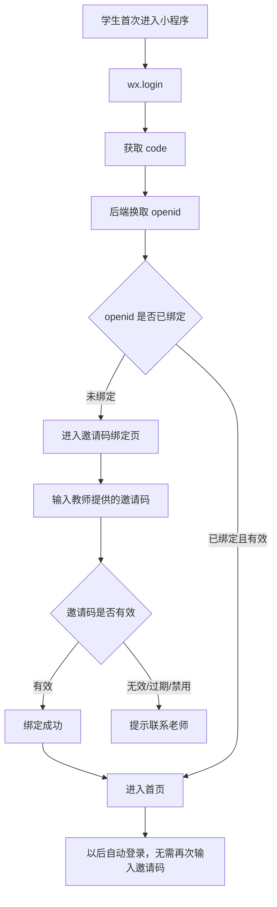
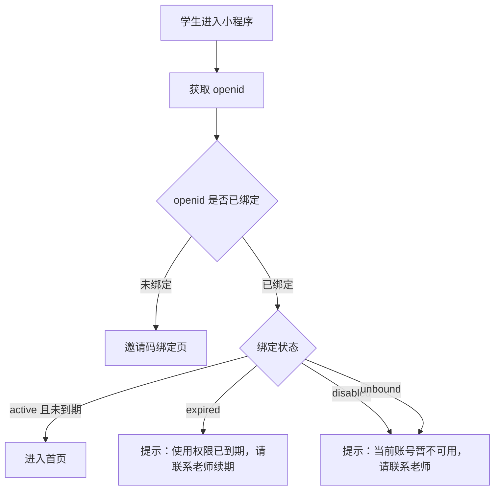
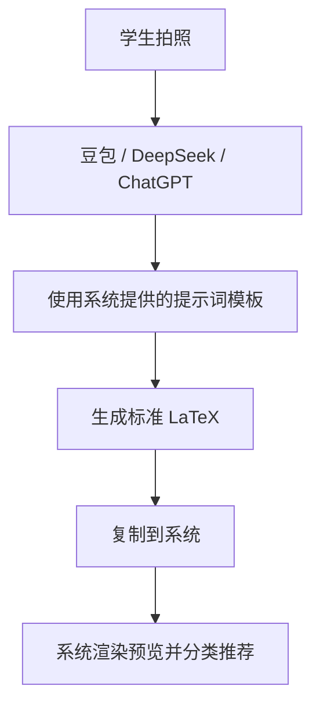
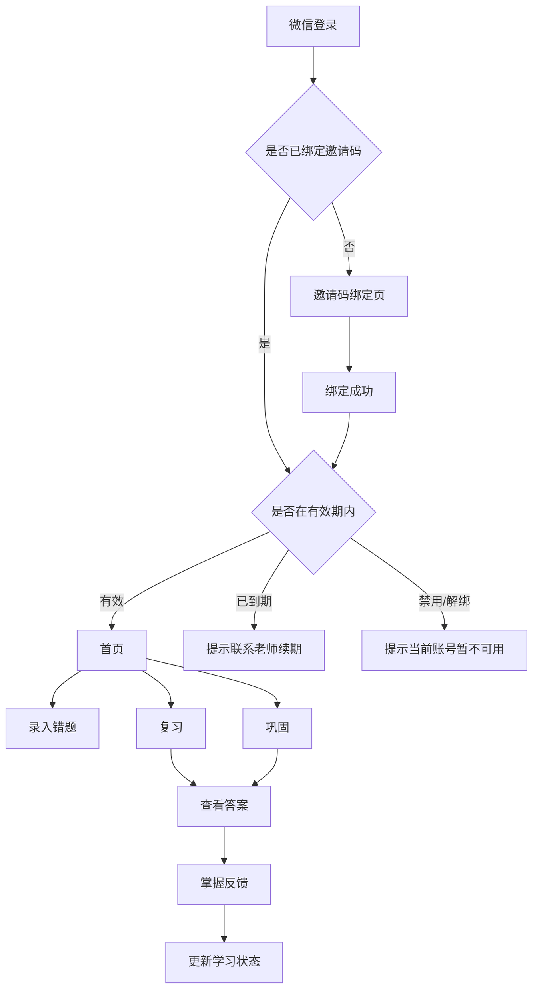

# 产品定位

江苏专转本数学错题复盘系统的小程序学生端，定位为学生每天复盘、巩固、查看错题和提交错题的轻量学习工具。

当前项目已经完成：

- Next.js Web 教师端
- 学生端 Web 页面
- Supabase 数据库
- Vercel 部署
- Student API

未来目标：

- 学生端逐步迁移为微信小程序。
- 教师端继续保留当前 Next.js Web 后台。
- 当前 Web 端保持现状，不修改 Supabase Auth、不修改数据库结构、不影响现有 Web 功能。

小程序不承担教师管理功能，不开放题型库维护、错题审核、教师题库和答案解析中心。学生端只围绕“今天该复习什么、今天该巩固什么、如何录入错题、如何查看答案解析”展开。

---

# 用户角色

小程序仅面向 `student`。

不面向：

- `teacher`
- `admin`

教师和管理员继续使用当前 Web 后台完成：

- 题型库维护
- 教师题库维护
- 错题审核
- 答案解析维护
- 邀请码与学生绑定管理，未来规划

---

# 当前 Web 与未来小程序边界

当前 Web 端保持现状：

- 教师 Web 端继续使用邮箱登录。
- 学生 Web 端继续使用邮箱登录。
- 不修改 Supabase Auth。
- 不修改现有登录系统。
- 不修改数据库结构。
- 不影响当前 Web 功能。

未来微信小程序学生端采用独立认证：

- 微信登录
- `openid`
- 教师邀请码绑定

小程序不使用：

- 手机号登录
- 邮箱登录
- 微信号登录
- 真实姓名登录

小程序可基于 `wx.login` 获取 `code`，再由后端调用微信接口换取 `openid`。`openid` 作为当前小程序内识别同一微信用户的唯一标识。

---

# 隐私原则

小程序遵循最小化收集原则。

系统不收集：

- 手机号
- 邮箱
- 微信号
- 真实姓名
- 用户头像
- 微信昵称

系统仅保存：

- `openid`
- `student_code`
- `invite_code`
- 学习数据
- 错题数据
- 复习记录

说明：

- `openid` 仅用于识别同一微信用户再次进入小程序。
- 不对学生展示 `openid`。
- `openid` 不作为公开信息。
- 教师如需识别学生，可在教师 Web 端填写备注，例如“张三”“一班01号”“VIP学生”。备注由教师维护，学生无需提交真实身份信息。

---

# 首次使用流程



文字流程：

1. 学生首次进入小程序。
2. 小程序调用 `wx.login`。
3. 获取 `code`。
4. 后端使用 `code` 换取 `openid`。
5. 后端检查 `openid` 是否已绑定。
6. 如果未绑定，进入邀请码绑定页。
7. 学生输入教师提供的邀请码。
8. 绑定成功后进入首页。
9. 后续再次进入时自动识别，无需重复输入邀请码。

---

# 学生使用期限管理

未来教师 Web 端新增：

- 邀请码管理
- 绑定管理
- 使用期限管理

规划字段：

- `starts_at`
- `expires_at`
- `bound_at`
- `unbound_at`

状态：

- `unused`
- `active`
- `expired`
- `disabled`
- `unbound`

访问规则：



---

# 教师端未来能力

教师 Web 端未来新增“邀请码管理”模块。

支持：

- 生成邀请码
- 查看邀请码状态
- 查看绑定学生数量
- 查看绑定时间
- 查看到期时间
- 修改到期时间
- 禁用邀请码
- 手动解绑学生

教师备注：

教师可为绑定学生填写备注，例如：

- 张三
- 一班01号
- VIP学生

备注由教师填写。学生无需提交真实身份信息。

---

# 未来 API 规划

仅作为设计规划，本阶段不实现。

## `POST /api/wechat/login`

用途：

- 小程序提交 `wx.login` 获取的 `code`。
- 后端换取 `openid`。
- 返回是否已绑定、是否可访问、是否需要进入邀请码绑定页。

请求字段：

- `code`

返回示例：

```json
{
  "ok": true,
  "data": {
    "bound": true,
    "status": "active"
  }
}
```

## `POST /api/wechat/bind-invite-code`

用途：

- 学生首次使用时绑定教师邀请码。
- 将 `openid` 与邀请码对应的学生访问资格绑定。

请求字段：

- `inviteCode`

## `GET /api/student/me`

用途：

- 返回当前小程序学生端的基础身份状态。
- 不返回手机号、邮箱、真实姓名、微信昵称、头像。

返回字段建议：

- `studentCode`
- `subscriptionStatus`
- `expiresAt`
- `teacherRemark` 可选，仅在需要展示时使用

## `GET /api/student/subscription-status`

用途：

- 检查当前学生是否仍在有效期内。
- 小程序启动、进入首页、提交学习反馈前可调用。

返回状态：

- `active`
- `expired`
- `disabled`
- `unbound`

---

# 未来数据库规划

仅作为设计规划，本阶段不创建 migration。

## `student_invite_codes`

用于存储教师生成的邀请码。

规划字段：

- `id`
- `invite_code`
- `created_by`
- `max_bindings`
- `starts_at`
- `expires_at`
- `status`
- `created_at`
- `updated_at`

状态：

- `unused`
- `active`
- `expired`
- `disabled`

## `student_wechat_bindings`

用于存储微信 `openid` 与学生访问资格的绑定关系。

规划字段：

- `id`
- `openid`
- `student_code`
- `invite_code_id`
- `teacher_note`
- `bound_at`
- `unbound_at`
- `status`
- `created_at`
- `updated_at`

状态：

- `active`
- `disabled`
- `unbound`

## `student_subscriptions`

用于管理学生小程序访问期限。

规划字段：

- `id`
- `binding_id`
- `starts_at`
- `expires_at`
- `status`
- `created_at`
- `updated_at`

状态：

- `active`
- `expired`
- `disabled`

---

# TabBar 设计

小程序底部 TabBar 设置 5 个入口：

## 首页

学习总览和今日行动入口。

主要承载：

- 考试倒计时
- 录入错题快捷入口
- 今日复习摘要
- 薄弱巩固摘要
- Top5 薄弱题型
- 掌握度图谱

## 复习

承载间隔复习任务。

主要承载：

- 今日复习任务
- 查看答案
- 已掌握 / 未掌握反馈

## 巩固

承载薄弱巩固和专项训练入口。

主要承载：

- 每日 5 题薄弱巩固
- 专项训练入口
- 题目来源标签
- 答案解析
- 完成反馈

## 错题

承载个人错题库查询。

主要承载：

- 错题列表
- 题型筛选
- 查看答案解析

## 我的

承载学生个人学习摘要和设置。

主要承载：

- 学习天数
- 错题数量
- 完成率
- 使用期限状态
- 隐私说明
- 设置

---

# 页面设计

## 首页

首页是学生打开小程序后的默认页面，风格参考 DaysMatter 的仪式感首页，但信息组织更接近学习应用。

模块：

- 考试倒计时
  - 标题：江苏专转本数学考试倒计时
  - 考试日期：2027年3月21日
  - 大号数字展示剩余天数
  - 文案：今天多复盘一道错题，考场上就少一个失分点。

- 录入错题快捷入口
  - 位置建议：倒计时卡片下方，与“今日复习”“薄弱巩固”并列。
  - 作用：学生做错题后可以快速进入录题流程。
  - TabBar 不设置“录题”，但首页必须有明显的“录入错题”按钮。

- 今日复习
  - 今日待复习数量
  - 今日已完成数量
  - 完成率
  - 点击进入“复习”Tab

- 薄弱巩固
  - 今日 5 题
  - 已完成数量
  - 点击进入“巩固”Tab

- Top5 薄弱题型
  - 一级分类 / 二级分类 / 三级题型
  - 掌握度百分比

- 知识点掌握度
  - 按一级分类展示掌握度
  - 使用横向进度条

首页原则：

- 一屏内先让学生知道“今天下一步该做什么”。
- 不堆复杂历史日志。
- 所有统计以 Student API 返回为准。

## 复习

对应当前 Web `/reviews` 的小程序形态。

模块：

- 今日复习任务
  - 默认展示 `review_date <= 今天` 且 `status = pending` 的任务。
  - 使用“题号导航 + 当前题详情”的做题模式。
  - 题目使用 `mistake.displayLatex` 渲染。

- 查看答案
  - 点击后在当前页展开答案解析，或使用半屏弹层。
  - 答案解析来自 `/api/student/solutions?mistakeId=<id>`。

- 已掌握 / 未掌握
  - 学生看完答案后自行判断。
  - 调用 `POST /api/student/reviews/[taskId]/complete`。

## 巩固

对应当前 `/api/student/weak-practice` 和未来专项训练。

薄弱巩固规则：

- 每日 5 题。
- 3 题来自最薄弱题型。
- 1 题来自次薄弱题型。
- 1 题来自随机挑战。
- 如果次薄弱题型题库不足，可以用随机题补足。

模块：

- 每日 5 题
- 来源标签
  - `weak`：薄弱题型
  - `secondary`：次薄弱题型
  - `random`：随机挑战
- 查看答案
- 已掌握 / 仍需巩固

## 错题

承载个人错题库。

模块：

- 错题列表
- 题型筛选
- 分类状态
- 查看答案解析

如果教师尚未补充答案解析，显示：

> 答案解析暂未补充，请等待老师更新。

## 我的

承载个人学习摘要和系统状态。

模块：

- 学习天数
- 错题数量
- 今日完成率
- 使用期限状态
- 隐私说明
- 联系老师提示

---

# 录题流程

小程序虽然不在 TabBar 中设置“录题”，但首页必须提供清晰的“录入错题”入口。

## 输入方式

当前规划采用 AI 录题助手模式。

学生可选择：

- 手动输入 LaTeX
- 粘贴外部 AI 转写结果

系统不实现 OCR。

录题推荐流程：

1. 学生拍清楚题目图片。
2. 打开豆包 / DeepSeek / ChatGPT。
3. 复制系统提供的提示词模板。
4. 让 AI 转成标准 LaTeX。
5. 复制到系统。
6. 检查预览无误后提交。

## 学生录入后

学生提交错题时只负责题目本身，不负责答案和解析。

学生可以：

- 选择系统推荐题型
- 手动选择已有题型
- 不确定时提交教师审核

学生不填写：

- 答案
- 解析
- 教师备注
- 是否加入教师题库

## 教师端处理

教师 Web 后台负责：

- 审核题型
- 补充答案解析
- 判断题目质量
- 决定是否加入教师题库

教师确认题型后，错题才能进入后续复习任务；教师补充答案解析后，学生才能在复习和错题页面查看完整解析。

---

# AI 录题方案

系统不实现 OCR。

采用：



系统仅提供：

- 单选题提示词
- 填空题提示词
- 计算题提示词

系统不做：

- 不上传图片
- 不保存图片
- 不调用 AI API
- 不保存外部 AI 对话内容

单选题输出格式要求：

```latex
若函数$f(x)$在$x=1$处连续,且$\lim\limits_{x \to 1}\frac{f(x)}{x-1}=2,$则$\lim\limits_{x \to 0}\frac{f(1-2x)}{x}=$\blankbox
\fourchoices
{$-4$}{$-1$}{$1$}{$4$}
```

填空题输出格式要求：

```latex
已知曲线$f(x)=\dfrac{e^x-1}{x-a}$有垂直渐近线$x=3$，则$a=$\_\_\_
```

计算题输出格式要求：

```latex
求极限：
$\lim\limits_{x \to 0}\dfrac{e^{x-\sin x}-1}{\arcsin x^3}$
```

---

# 题目来源追踪

教师题库 `problems` 中的题目来源需要长期保留，便于题目质量追踪和题库沉淀。

题目来源包括：

- `teacher_created`：教师主动录入。
- `student_submitted`：学生错题贡献后，由教师在答案解析中心手动加入题库。

需要保留：

- 提交人
- 来源错题
- 创建时间

作用：

- 题目内容、答案或解析出错时，可以快速追溯来源。
- 教师可以判断题目是否来自高频学生错题。
- 长期积累教师题库时，可以区分教师主动沉淀和学生错题沉淀。

---

# 教师端和学生端分工

学生小程序只负责：

- 录入错题
- 查看错题
- 今日复习
- 薄弱巩固
- 专项训练
- 查看答案解析

教师 Web 端负责：

- 题型库维护
- 教师题库维护
- 错题审核
- 答案解析维护
- 是否加入题库的判断
- 邀请码和使用期限管理，未来规划

分工原则：

- 学生端保持轻量，不承担题库维护和答案解析维护。
- 教师端负责保证题型、题目、答案和解析质量。
- 学生提交的错题不会自动进入教师题库，必须由教师在答案解析中心手动选择。

---

# 页面与 API 对应关系

## 首页

调用：

- `GET /api/student/dashboard`

用途：

- 获取今日复习数量、今日完成数量、完成率、连续学习天数。
- 获取 Top5 薄弱题型。
- 获取知识点掌握度。
- 获取最近 7 天学习总结。
- 首页提供“录入错题”快捷入口，但该入口进入录题流程，不由 dashboard 接口提交。

## 复习

调用：

- `GET /api/student/reviews`
- `GET /api/student/solutions?mistakeId=<id>`
- `POST /api/student/reviews/[taskId]/complete`

用途：

- 获取今日复习任务。
- 获取错题答案解析。
- 提交已掌握 / 未掌握反馈。

## 录题流程

调用：

- `POST /api/student/mistakes`

用途：

- 学生提交新错题。
- 学生可以自行选择题型，也可以提交教师审核。
- 学生不填写答案和解析。

请求字段：

- `inputType`
- `rawText`
- `latexContent`
- `questionTypeId` 可选
- `submitForReview` boolean
- `note` 可选

## 巩固

调用：

- `GET /api/student/weak-practice`
- `POST /api/student/weak-practice/[taskId]/complete`

用途：

- 获取或生成当天薄弱巩固任务。
- 展示每日 5 题。
- 提交已掌握 / 仍需巩固反馈。

## 错题

调用：

- `GET /api/student/mistakes`
- `GET /api/student/mistakes?questionTypeId=<uuid>`
- `GET /api/student/solutions?mistakeId=<id>`

用途：

- 获取学生个人错题列表。
- 根据题型筛选错题。
- 查看指定错题的答案解析。

## 我的

调用：

- `GET /api/student/me`
- `GET /api/student/subscription-status`
- `GET /api/student/dashboard`

用途：

- 获取小程序绑定状态。
- 获取使用期限状态。
- 获取基础学习统计。

## API 统一返回格式

成功：

```json
{
  "ok": true,
  "data": {}
}
```

失败：

```json
{
  "ok": false,
  "error": {
    "code": "UNAUTHORIZED",
    "message": "请先登录"
  }
}
```

错误码：

- `UNAUTHORIZED`
- `FORBIDDEN`
- `NOT_FOUND`
- `VALIDATION_ERROR`
- `SERVER_ERROR`
- `SUBSCRIPTION_EXPIRED`
- `ACCOUNT_DISABLED`
- `ACCOUNT_UNBOUND`

---

# 用户流程图



---

# UI 风格

参考：

- DaysMatter
- 微信读书
- 得到

关键词：

- 极简
- 卡片式
- 学习感
- 数学风

视觉原则：

- 首页有仪式感，倒计时数字足够突出。
- 任务页轻量，卡片清晰，按钮明确。
- 颜色克制，不做强娱乐化设计。
- 数学题展示优先保证可读性。
- LaTeX 公式区域允许横向滚动。

---

# 小程序 LaTeX 渲染策略

小程序端题目展示优先使用接口返回的 `displayLatex`，避免小程序端重复判断 `rawLatex`、`latexContent`、`rawText` 和 `stem` 的优先级。

渲染策略：

- 优先渲染 `displayLatex`。
- 渲染失败时降级显示 `stem`。
- 公式区域允许横向滚动，避免长公式挤压页面。
- 答案和解析同样需要支持 LaTeX 或 Markdown + LaTeX。

需要支持的自定义命令：

- `\blankbox`
- `\fourchoices`
- `\_\_\_`

---

# MVP 路线图

## V1

目标：完成学生端小程序最小可用闭环。

功能：

- 微信登录获取 `openid`。
- 邀请码绑定。
- 使用期限检查。
- 首页 Dashboard。
- 首页录入错题快捷入口。
- AI 录题助手提示词。
- 今日复习。
- 查看答案解析。
- 薄弱巩固每日 5 题。
- 错题列表与题型筛选。
- 我的页基础统计和使用状态。

API：

- 复用现有 `GET /api/student/dashboard`
- 复用现有 `GET /api/student/reviews`
- 复用现有 `GET /api/student/weak-practice`
- 复用现有 `GET /api/student/mistakes`
- 复用现有 `GET /api/student/solutions`
- 规划 `POST /api/wechat/login`
- 规划 `POST /api/wechat/bind-invite-code`
- 规划 `GET /api/student/me`
- 规划 `GET /api/student/subscription-status`
- 规划 `POST /api/student/reviews/[taskId]/complete`
- 规划 `POST /api/student/weak-practice/[taskId]/complete`

## V2

目标：提升学习体验和复盘效率。

功能：

- 专项训练
  - 学生可以按一级 / 二级 / 三级题型选择专题。
  - 从教师题库中抽题练习。
  - 适合考前集中突破。
- 错题题型级联筛选。
- 复习日历。
- 连续学习打卡。
- 最近 7 天 / 30 天学习报告。
- 答案解析收藏。
- 消息提醒或订阅通知。

说明：

- OCR 不进入当前路线。现阶段明确采用外部 AI 转写 + 系统提示词模板模式。

## V3

目标：智能化和规模化。

功能：

- AI 题型分类。
- AI 生成错题讲解草稿。
- 个性化复习计划。
- 班级维度学习报告。
- 教师端与小程序联动通知。

---

# 本次文档约束

本次仅更新设计文档。

不修改：

- 登录代码
- 页面代码
- Supabase Auth
- 数据库 schema
- API 实现
- 小程序代码
