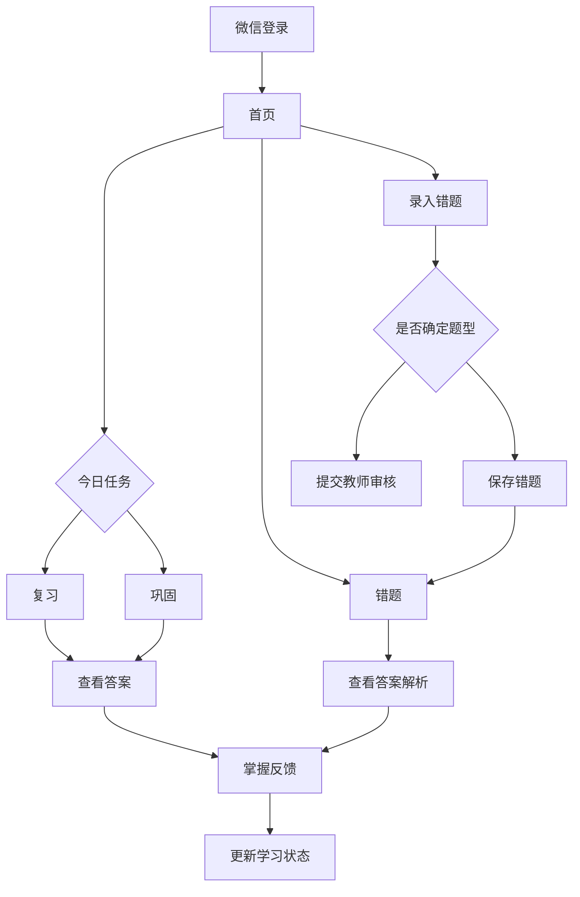

# 产品定位

江苏专转本数学错题复盘系统的小程序学生端，定位为学生每天复盘、巩固和查看错题的轻量学习工具。

当前项目已经完成 Next.js Web 教师端、学生端 Web 页面、Supabase 数据库、Vercel 部署和 Student API。未来迁移时，教师端继续保留 Web 后台，学生端逐步迁移为微信小程序。

小程序不承担教师管理功能，不开放题型库维护、错题审核、教师题库和答案解析中心。学生端只围绕“看今天该复习什么、练今天该巩固什么、查自己的错题和答案解析”展开。

核心目标：

- 降低学生打开成本，让复习动作更接近日常打卡。
- 保持题目、答案、解析的 LaTeX 展示能力。
- 复用现有 `/api/student/*` 接口，避免小程序直接理解复杂数据库结构。
- 不改变教师端 Web 后台和现有 Supabase 数据模型。

---

# 用户角色

仅 `student`。

小程序端不面向：

- `teacher`
- `admin`

如果 `teacher/admin` 账号调用学生端 API，应返回 `FORBIDDEN`。教师和管理员仍使用当前 Next.js Web 后台完成题型库、错题审核、教师题库和答案解析维护。

---

# TabBar设计

小程序底部 TabBar 设置 5 个入口。

## 首页

学习总览和今日行动入口。

主要承载：

- 考试倒计时
- 录入错题快捷入口
- 今日复习摘要
- 薄弱巩固摘要
- Top5 薄弱题型
- 掌握度图谱

## 复习

承载间隔复习任务。

主要承载：

- 今日复习任务
- 查看答案
- 已掌握 / 未掌握反馈

## 巩固

承载每日薄弱巩固训练。

主要承载：

- 每日 5 题
- 来源标签
- 答案解析
- 完成反馈

## 错题

承载个人错题库查询。

主要承载：

- 错题列表
- 题型筛选
- 查看答案解析

## 我的

承载学生个人学习摘要和设置。

主要承载：

- 学习天数
- 错题数量
- 完成率
- 设置

---

# 页面设计

## 首页

首页是学生打开小程序后的默认页面，风格参考 DaysMatter 的仪式感首页，但信息组织更接近学习应用。

模块：

- 考试倒计时
  - 标题：江苏专转本数学考试倒计时
  - 考试日期：2027年3月21日
  - 大号数字展示剩余天数
  - 文案：今天多复盘一道错题，考场上就少一个失分点。

- 录入错题快捷入口
  - 位置建议：倒计时卡片下方，与“今日复习”“薄弱巩固”并列。
  - 作用：学生做错题后可以快速进入录题流程。
  - TabBar 不设置“录题”，但首页必须有明显的“录入错题”按钮，避免学生找不到最核心的错题沉淀入口。

- 今日复习
  - 今日待复习数量
  - 今日已完成数量
  - 完成率
  - 点击进入“复习”Tab

- 薄弱巩固
  - 今日 5 题
  - 已完成数量
  - 点击进入“巩固”Tab

- Top5 薄弱题型
  - 展示一级分类 / 二级分类 / 三级题型
  - 展示掌握度百分比
  - 适合使用紧凑列表或小卡片

- 掌握度图谱
  - 按一级分类展示掌握度
  - 使用横向进度条
  - 颜色保持克制，突出学习状态而不是装饰

首页原则：

- 一屏内先让学生知道“今天还差什么”。
- 不堆复杂操作，主要提供跳转入口。
- 所有统计以 Student API 返回为准。

## 复习

复习页对应当前 Web `/reviews` 的学生端小程序形态。

模块：

- 今日复习任务
  - 默认展示 `review_date <= 今天` 且 `status = pending` 的任务。
  - 每张任务卡展示题目、题型、复习轮次。
  - 题目使用 `mistake.displayLatex` 渲染。

- 查看答案
  - 点击后进入答案弹层或答案页。
  - 第一版建议使用半屏弹层，减少页面跳转。
  - 答案解析来自 `/api/student/solutions?mistakeId=<id>`。

- 已掌握 / 未掌握
  - 学生看完答案后进行反馈。
  - 当前 Student API 只提供读取能力，完成复习动作后续可新增对应 POST 接口。
  - 小程序 V1 可先跳转 Web 或等待 API 补齐后启用按钮。

展示字段建议：

- `task.id`
- `task.reviewDate`
- `task.reviewRound`
- `task.mistake.displayLatex`
- `task.mistake.hasAnswerContent`
- `task.mistake.questionType`

## 巩固

巩固页对应 `/api/student/weak-practice`。

模块：

- 每日 5 题
  - 题目来自教师题库 `problems`。
  - 只展示当前学生当天任务。
  - 每题展示题目、题型、来源标签和完成状态。

- 推荐结构
  - 3 题来自最薄弱题型。
  - 1 题来自次薄弱题型。
  - 1 题来自随机挑战。
  - 当前后端推荐逻辑支持 `weak`、`secondary`、`random` 三类来源。
  - 如果次薄弱题型题库不足，可以用随机题补足，保证每日训练数量尽量达到 5 题。

- 来源标签
  - `weak`：薄弱题型
  - `secondary`：次薄弱题型
  - `random`：随机挑战

- 查看答案
  - 展示 `problem.answer`
  - 展示 `problem.analysis`
  - 支持 LaTeX / Markdown + LaTeX

- 完成反馈
  - 已完成
  - 仍需巩固
  - 当前 Student API 只提供读取能力，提交动作后续可新增 POST 接口。

展示字段建议：

- `task.id`
- `task.sourceType`
- `task.sourceLabel`
- `task.status`
- `task.result`
- `task.problem.displayLatex`
- `task.problem.answer`
- `task.problem.analysis`
- `task.problem.questionType`

# 录题流程

小程序虽然不在 TabBar 中设置“录题”，但首页必须提供清晰的“录入错题”快捷入口。录题是学生端最重要的数据入口，决定后续复习、巩固和题型统计是否有效。

## 输入方式

V1 支持：

- 手动输入 LaTeX
- 粘贴外部 AI 转写结果

V2 支持：

- OCR 拍照识别
- 学生拍照后由 OCR 识别为文本或 LaTeX
- 学生确认识别结果后再提交错题

推荐流程：

拍照
↓
OCR识别
↓
学生确认
↓
提交错题

## 学生录入后

学生提交错题时只负责题目本身，不负责答案和解析。

学生可以：

- 选择系统推荐题型
- 手动选择已有题型
- 不确定时提交教师审核

学生不填写：

- 答案
- 解析
- 教师备注
- 是否加入教师题库

## 教师端处理

教师端 Web 后台负责：

- 审核题型
- 补充答案解析
- 判断题目质量
- 决定是否加入教师题库

教师确认题型后，错题才能进入后续复习任务；教师补充答案解析后，学生才能在复习和错题页中查看完整解析。

## 错题

错题页对应个人错题库。

模块：

- 错题列表
  - 展示学生自己的错题。
  - 默认按录入时间倒序。
  - 每张卡片展示题目、题型、分类状态和录入时间。

- 题型筛选
  - 支持按题型筛选。
  - V1 可先使用三级题型选择。
  - V2 再补一级 / 二级 / 三级级联筛选体验。

- 查看答案解析
  - 点击错题卡片进入答案解析页或弹层。
  - 调用 `/api/student/solutions?mistakeId=<id>`。
  - 如果教师尚未补充答案解析，显示“答案解析暂未补充，请等待老师更新。”

展示字段建议：

- `mistake.id`
- `mistake.rawLatex`
- `mistake.latexContent`
- `mistake.rawText`
- `mistake.stem`
- `mistake.classificationStatus`
- `mistake.questionType`

## 我的

我的页承载个人信息和基础学习统计。

模块：

- 学习天数
  - 可复用 Dashboard 的连续复习天数。

- 错题数量
  - 可由错题列表接口统计。
  - V1 也可由首页 Dashboard 汇总展示。

- 完成率
  - 展示今日完成率或近 7 天完成率。
  - V1 可先使用 Dashboard 中的今日完成率。

- 设置
  - 账号信息
  - 退出登录
  - 隐私说明
  - 关于系统

---

# 题目来源追踪

教师题库 `problems` 中的题目来源需要长期保留，便于题目质量追踪和题库沉淀。

题目来源包括：

- `teacher_created`：教师主动录入。
- `student_submitted`：学生错题贡献后，由教师在答案解析中心手动加入题库。

需要保留的信息：

- 提交人
- 来源错题
- 创建时间

业务作用：

- 题目内容、答案或解析出错时，可以快速追溯来源。
- 教师可以判断题目是否来自高频学生错题，便于后续集中讲解。
- 长期积累教师题库时，可以区分“教师主动沉淀”和“学生错题沉淀”。
- 后续做专项训练、薄弱巩固和智能推荐时，可以优先使用质量更高、答案解析更完整的题目。

---

# 教师端和学生端分工

学生小程序只负责：

- 录入错题
- 查看错题
- 今日复习
- 薄弱巩固
- 查看答案解析

教师 Web 端负责：

- 题型库维护
- 教师题库维护
- 错题审核
- 答案解析维护
- 是否加入题库的判断

分工原则：

- 学生端保持轻量，不承担题库维护和答案解析维护。
- 教师端负责保证题型、题目、答案和解析质量。
- 学生提交的错题不会自动进入教师题库，必须由教师在答案解析中心手动选择。

---

# 页面与API对应关系

## 首页

调用：

- `GET /api/student/dashboard`

用途：

- 获取考试倒计时下方的学习统计。
- 获取今日复习数量、今日完成数量、完成率、连续学习天数。
- 获取 Top5 薄弱题型。
- 获取知识点掌握度图谱。
- 获取最近复习记录和 30 天时间轴。
- 首页还提供“录入错题”快捷入口；该入口进入录题流程，当前读取类 Student API 不负责提交动作。

## 复习

调用：

- `GET /api/student/reviews`
- `GET /api/student/solutions?mistakeId=<id>`

用途：

- `/api/student/reviews` 获取今日复习任务列表和已完成数量。
- `/api/student/solutions` 获取某道错题的答案和解析。

## 录题流程

调用：

- `POST /api/student/mistakes`

用途：

- 学生提交新错题。
- 学生可以自行选择题型，也可以提交教师审核。
- 学生不填写答案和解析。

请求字段：

- `inputType`
- `rawText`
- `latexContent`
- `questionTypeId` 可选
- `submitForReview` boolean
- `note` 可选

## 巩固

调用：

- `GET /api/student/weak-practice`

用途：

- 获取或生成当天薄弱巩固任务。
- 展示每日 5 题。
- 展示来源标签、题目、答案、解析和完成状态。

## 错题

调用：

- `GET /api/student/mistakes`
- `GET /api/student/mistakes?questionTypeId=<uuid>`
- `GET /api/student/solutions?mistakeId=<id>`

用途：

- 获取学生个人错题列表。
- 根据题型筛选错题。
- 查看指定错题的答案解析。

## 我的

调用：

- `GET /api/student/dashboard`
- `GET /api/student/mistakes`

用途：

- 获取连续学习天数、完成率等学习摘要。
- 获取错题数量。
- 后续如需用户资料，可新增 `/api/student/profile`。

## API统一返回格式

成功：

```json
{
  "ok": true,
  "data": {}
}
```

失败：

```json
{
  "ok": false,
  "error": {
    "code": "UNAUTHORIZED",
    "message": "请先登录"
  }
}
```

错误码：

- `UNAUTHORIZED`
- `FORBIDDEN`
- `NOT_FOUND`
- `VALIDATION_ERROR`
- `SERVER_ERROR`

---

# 用户流程图



文字流程：

登录
↓
首页
↓
录入错题 / 复习 / 巩固
↓
查看答案
↓
掌握反馈

或：

登录
↓
首页
↓
复习 / 巩固
↓
查看答案
↓
掌握反馈

---

# UI风格

参考：

- DaysMatter
- 微信读书
- 得到

关键词：

- 极简
- 卡片式
- 学习感
- 数学风

## 视觉原则

- 首页有仪式感，倒计时数字要足够突出。
- 任务页要轻，卡片清晰，按钮明确。
- 颜色克制，不做强娱乐化设计。
- 数学题展示优先保证可读性，公式区域留足行距。
- 答案解析区域要有明显层级，避免题目、答案、解析混在一起。

## 组件建议

- 倒计时卡片
- 今日任务卡片
- 题目卡片
- 来源标签
- 掌握度进度条
- 答案解析弹层
- 空状态卡片
- 错误提示条

## 字体与排版

- 标题简洁，避免过长解释。
- 数字信息使用大字号。
- 题目正文使用适合阅读的行高。
- LaTeX 渲染区域避免过窄，必要时支持横向滚动。

## 小程序 LaTeX 渲染策略

小程序端题目展示优先使用接口返回的 `displayLatex`，避免小程序端重复判断 `rawLatex`、`latexContent`、`rawText` 和 `stem` 的优先级。

渲染策略：

- 优先渲染 `displayLatex`。
- 渲染失败时降级显示 `stem`。
- 公式区域允许横向滚动，避免长公式挤压页面。
- 答案和解析同样需要支持 LaTeX 或 Markdown + LaTeX。

需要支持的自定义命令：

- `\blankbox`
- `\fourchoices`
- `\_\_\_`

---

# 微信登录方案

## V1建议方案

小程序使用微信登录获取 `code`，发送到 Next.js 后端 Route Handler。后端完成：

1. 使用微信 `code2session` 换取 `openid`。
2. 根据 `openid` 查找已绑定学生账号。
3. 如果已绑定，建立学生登录态。
4. 小程序后续调用 `/api/student/*`。

由于当前系统已使用 Supabase Auth，V1 可采用“账号绑定”策略：

- 教师先在 Web 后台或 Supabase 中创建学生账号。
- 学生首次进入小程序时输入手机号、邮箱或邀请码进行绑定。
- 绑定成功后记录微信 `openid` 与学生账号关系。
- 后续使用微信静默登录。

## 可选实现路径

### 路径A：Next.js作为小程序BFF

小程序只调用 Next.js API。

优点：

- 不暴露 Supabase 细节给小程序。
- 可复用现有 `services/student/*`。
- 权限逻辑集中在服务端。
- 后续可接微信登录、缓存、限流和审计。

缺点：

- 需要维护小程序登录态与 Web 登录态之间的映射。

### 路径B：小程序直连Supabase

小程序直接使用 Supabase 接口。

优点：

- 架构链路短。

缺点：

- 微信登录与 Supabase Auth 打通更复杂。
- 小程序需要理解更多数据结构。
- 权限与数据转换分散，不利于后续稳定 API。

建议：

V1 使用路径A，也就是 Next.js 作为 BFF。当前 `/api/student/*` 已经是这个方向的准备。

## 登录态建议

- 小程序端保存后端签发的短期 token 或 session cookie。
- 后端所有 `/api/student/*` 接口统一校验身份。
- 只允许 `student` 角色访问。
- `teacher/admin` 访问学生 API 返回 `FORBIDDEN`。

---

# MVP路线图

## V1

目标：完成学生端小程序最小可用闭环。

功能：

- 微信登录与学生账号绑定。
- 首页 Dashboard。
- 首页录入错题快捷入口。
- 今日复习列表。
- 查看答案解析。
- 薄弱巩固每日 5 题。
- 错题列表与题型筛选。
- 我的页基础统计。

API：

- 复用现有 `/api/student/dashboard`
- 复用现有 `/api/student/reviews`
- 复用现有 `/api/student/weak-practice`
- 复用现有 `/api/student/mistakes`
- 复用现有 `/api/student/solutions`
- 新增 `POST /api/student/reviews/[taskId]/complete`，用于今日复习反馈。
- 新增 `POST /api/student/weak-practice/[taskId]/complete`，用于薄弱巩固反馈。

交付标准：

- 学生可每天打开小程序完成复习和巩固。
- 教师仍在 Web 后台维护题型、审核错题和补答案解析。
- 小程序不做教师端功能。

## V2

目标：提升学习体验和复盘效率。

功能：

- 错题题型级联筛选。
- 复习日历。
- 连续学习打卡。
- 近 7 天 / 30 天学习报告。
- 答案解析收藏。
- 薄弱题型专项训练入口。
- 专项训练：学生可以按一级 / 二级 / 三级题型选择专题，并从教师题库中抽题练习，适合考前集中突破。
- OCR 题目录入：真实学生不一定会 LaTeX，V2 需要支持“拍照 -> OCR识别 -> 学生确认 -> 提交错题”。
- 消息提醒或订阅通知。

API：

- 新增学习报告接口。
- 新增打卡统计接口。
- 新增错题收藏或标记接口。
- 新增专项训练接口。
- 新增 OCR 上传与识别确认接口。

交付标准：

- 学生能清楚知道自己薄弱在哪里。
- 学生能形成稳定复习习惯。

## V3

目标：智能化和规模化。

功能：

- AI 题型分类。
- AI 生成错题讲解草稿。
- 个性化复习计划。
- 班级维度学习报告。
- 教师端与小程序联动通知。

API：

- 新增 AI 分类接口。
- 新增个性化推荐接口。
- 新增教师通知接口。

交付标准：

- 学生录题成本显著降低。
- 教师维护压力降低。
- 系统能基于学习数据给出更准确的复习建议。
