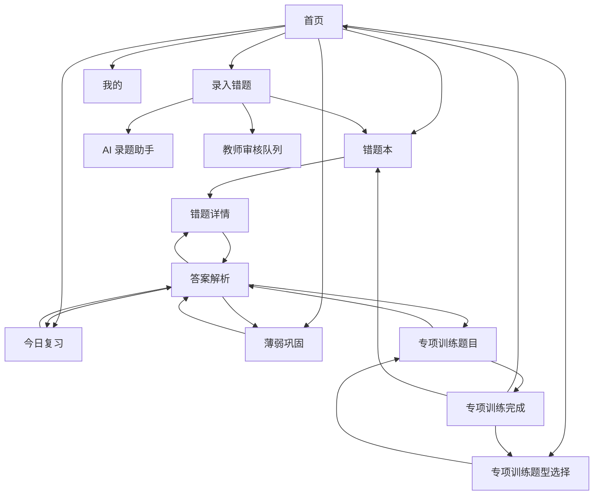

# 微信小程序最终规范

本文档是“江苏专转本数学错题复盘系统”微信小程序学生端的最终 UI 与交互规范来源。

本版以已确认的 Stitch 页面截图为准，并结合当前产品决策修正。后续小程序开发应以本文档为唯一小程序 UI 规范来源。

适用范围：

- 微信小程序学生端
- 手机优先纵向卡片流
- 教师端继续保留现有 Web 后台
- 功能逻辑与现有系统保持一致

重要原则：

- 页面结构以最终 Stitch 截图为准。
- 页面模块以最终 Stitch 截图为准。
- 页面交互以最终 Stitch 截图和本文档明确规则为准。
- 不允许凭空增加截图和本文档都未定义的模块。
- 不允许保留已经被 UI 删除的旧模块。
- 如果后续上传新版截图，以最新截图覆盖本文档对应页面规范。

---

# 1. 页面清单

| 页面 | 建议路由 | 所属入口 | 说明 |
| --- | --- | --- | --- |
| 首页 | `/pages/home/index` | Tab：首页 | 每日学习入口 |
| 今日复习 | `/pages/review/index` | Tab：复习 | 今日复习做题页 |
| 薄弱巩固 | `/pages/weak-practice/index` | Tab：巩固 | 系统推荐 5 道薄弱巩固题 |
| 专项训练题型选择 | `/pages/practice/index` | Tab：巩固 | 选择三级题型并开始训练 |
| 专项训练题目 | `/pages/practice/session` | 专项训练 | 5 题训练做题页 |
| 专项训练完成 | `/pages/practice/summary` | 专项训练 | 训练总结与加入错题库 |
| AI 录题助手 | `/pages/mistake/ai-helper` | 录入错题 | 外部 AI 转 LaTeX 提示词页 |
| 错题录入 | `/pages/mistake/new` | 首页快捷入口 | LaTeX 录题、题型推荐、教师审核兜底 |
| 错题本 | `/pages/mistake/index` | Tab：错题 | 错题列表与筛选 |
| 错题详情 | `/pages/mistake/detail` | 错题本 | 错题内容与学习记录 |
| 答案解析 | `/pages/solution/detail` | 多来源 | 题目答案、解析、知识点和建议 |
| 我的 | `/pages/profile/index` | Tab：我的 | 授权状态、学习统计和设置 |

---

# 2. 产品定位

产品名称：江苏专转本数学错题复盘系统

定位：

- 面向江苏专转本数学学生的错题复盘、复习巩固与专项训练小程序。
- 学生每天打开后，优先知道今天该做什么。
- 核心路径是录入错题、今日复习、薄弱巩固、专项训练、查看答案解析。
- 答案与解析由教师 Web 后台维护，学生端只负责学习、录题和反馈掌握状态。

小程序不承担教师后台能力：

- 不维护题型库。
- 不维护教师题库。
- 不审核学生错题。
- 不编辑答案解析。

---

# 3. 用户画像

唯一角色：student

典型用户：

- 江苏专转本备考学生。
- 数学基础差异较大，需要反复复盘错题。
- 手机使用场景多，学习动作需要短、清晰、低负担。
- 不要求学生填写答案和解析。
- 可借助外部 AI 工具把题目图片转换为 LaTeX，再粘贴到系统。

学生端关注点：

- 今天要复习什么。
- 哪些题还没掌握。
- 哪些薄弱题型需要巩固。
- 训练后能否把未掌握题目加入错题库。
- 能否快速查看标准答案和解析。
- 题型不确定时能否交给老师确认。

---

# 4. 信息架构

```text
江苏专转本数学错题复盘系统
├─ 首页
│  ├─ 考试倒计时
│  ├─ 快捷入口
│  │  ├─ 录入错题
│  │  ├─ 今日复习
│  │  ├─ 薄弱巩固
│  │  └─ 专项训练
│  ├─ 今日待复习
│  ├─ 薄弱巩固状态
│  ├─ 专项训练状态
│  ├─ 薄弱考点 Top 5
│  └─ 近 7 日学习数据
├─ 复习
│  └─ 今日复习做题
├─ 巩固
│  ├─ 薄弱巩固
│  └─ 专项训练
│     ├─ 题型选择
│     ├─ 训练做题
│     └─ 训练完成
├─ 错题
│  ├─ 错题本
│  ├─ 错题详情
│  └─ 答案解析
└─ 我的
   ├─ 系统授权
   ├─ 学习统计
   └─ 设置入口
```

---

# 5. TabBar 结构

底部 TabBar 固定为 5 项：

| Tab | 文案 | 定位 | 默认页面 |
| --- | --- | --- | --- |
| 1 | 首页 | 每日学习入口 | 首页 |
| 2 | 复习 | 今日复习任务 | 今日复习 |
| 3 | 巩固 | 薄弱巩固与专项训练 | 巩固入口或专项训练题型选择 |
| 4 | 错题 | 错题本 | 错题本 |
| 5 | 我的 | 授权与个人学习统计 | 我的 |

TabBar 样式：

- 图标在上，文字在下。
- 当前选中项使用深绿色。
- 非选中项使用深灰绿色。
- 错题 Tab 选中时可使用浅蓝色圆角背景高亮。
- 二级页面可保留 TabBar，但需要顶部返回箭头。

---

# 6. 页面跳转关系



返回规则：

- 顶部返回箭头优先返回上一页。
- 答案解析页必须保留来源上下文。
- 从错题详情进入答案解析，底部按钮文案为“返回错题”。
- 从今日复习进入答案解析，返回今日复习。
- 从薄弱巩固进入答案解析，返回薄弱巩固。
- 从专项训练进入答案解析，返回专项训练题目页。
- 首页和我的页不显示顶部返回箭头。

---

# 7. 页面结构

## 7.1 首页

页面定位：学生每日打开后的默认首页。

页面结构按截图顺序：

1. 顶部品牌栏
   - 左侧学士帽图标
   - 文案：江苏专转本数学错题复盘系统

2. 考试倒计时卡片
   - 标题：江苏专转本数学考试倒计时
   - 大号剩余天数，例如 `1024 天`
   - 副文案：距离 2027年3月21日
   - 分割线
   - 激励文案：“今天多复盘一道错题，考场上就少一个失分点。”

3. 四个快捷入口
   - 录入错题
   - 今日复习
   - 薄弱巩固
   - 专项训练

4. 今日待复习主卡
   - 标题：今日待复习
   - 描述：包含 N 道错题，M 个概念
   - 右侧大号数字
   - 右侧圆形箭头按钮

5. 两张状态卡
   - 薄弱巩固：数字 + 状态“需关注”
   - 专项训练：数字或 `-` + 状态“未开始”

6. 薄弱考点 Top 5
   - 标题：薄弱考点 Top 5
   - 右侧：查看全部
   - 每项包含考点名称、掌握度百分比、进度条
   - 截图展示 3 项，实际最多展示 5 项

7. 近 7 日学习数据
   - 2 x 2 小卡片
   - 新增错题
   - 完成复习
   - 专项训练
   - 薄弱巩固

页面不包含：

- 最近复习记录
- 大型图表
- 独立学习报告入口
- 教师端入口

## 7.2 今日复习

页面定位：今日复习任务做题页。

页面结构：

1. 顶部导航栏
   - 左侧返回箭头
   - 标题：今日复习
   - 右侧更多按钮

2. 进度区
   - 文案：第 X 题 / 共 N 题
   - 右侧百分比，例如 `40%`
   - 横向进度条

3. 题号导航
   - 圆形题号
   - 已掌握显示深绿色实心圆和对勾
   - 当前题显示绿色描边和题号
   - 待做显示灰色描边
   - 题号下方显示状态文字：已掌握、复习中、待做

4. 当前题卡片
   - 顶部标签：题型，例如“导数计算”
   - 顶部标签：复习轮次，例如“Day 3”
   - 右上角收藏图标
   - 题目内容
   - LaTeX 代码块或公式区域
   - 查看答案与解析按钮

5. 底部固定操作栏
   - 左侧：未掌握
   - 右侧：已掌握

交互：

- 点击题号可切换当前题。
- 点击“查看答案与解析”进入答案解析页，携带返回来源。
- 点击“未掌握”标记当前复习任务为未掌握。
- 点击“已掌握”标记当前复习任务为已掌握。
- 完成后题号状态立即变化。
- 做题页一次只展示一道题，不展示长列表。

## 7.3 薄弱巩固

页面定位：系统根据学生薄弱题型推荐 5 道巩固题，学生查看答案解析后自主判断掌握情况。

所属 Tab：巩固

页面结构与今日复习、专项训练题目页保持一致：

1. 顶部导航栏
   - 左侧返回箭头
   - 标题：薄弱巩固
   - 右侧可显示更多按钮或当前进度

2. 进度区
   - 文案：第 X 题 / 共 5 题
   - 右侧百分比
   - 横向进度条

3. 题号导航
   - 第 1 题到第 5 题
   - 当前题为深绿色选中态
   - 已掌握为成功态
   - 仍需巩固为警示态
   - 未完成为普通态

4. 当前题卡片
   - 来源标签：薄弱题型、次薄弱题型、随机挑战
   - 题型标签
   - 题目 LaTeX 渲染区
   - 查看答案与解析按钮

5. 底部固定操作栏
   - 左侧：仍需巩固
   - 右侧：已掌握

交互：

- 每日默认 5 题。
- 一次只展示一道题。
- 学生可点击题号自由切换。
- 每题默认只展示题目。
- 点击“查看答案与解析”后进入答案解析页或展开解析，必须保留返回薄弱巩固的来源上下文。
- 学生查看答案解析后自主判断掌握情况。
- 点击“仍需巩固”：记录 `result = not_mastered`。
- 点击“已掌握”：记录 `result = mastered`。
- 不出现学生答案输入框。
- 不做自动批改。
- 所有题完成后显示完成状态或回到首页刷新薄弱巩固状态。

## 7.4 专项训练题型选择

页面定位：学生选择三级题型开始专项训练。

页面结构：

1. 顶部导航栏
   - 返回箭头
   - 标题：专项训练

2. 页面主标题区
   - 一级学科标题，例如：高等数学
   - 右侧标签：专升本真题库

3. 折叠分类区
   - 展开的二级分类，例如“一元函数微积分”
   - 折叠箭头
   - 未展开分类，例如“多元函数微积分”

4. 三级题型卡片列表
   - 题型名称，例如：导数定义
   - 可练题量，例如：42 题可练
   - 掌握度，例如：45% 掌握度
   - 掌握度进度条
   - 低掌握度可用棕红色强调

5. 底部固定按钮
   - 开始训练
   - 未选择题型时为浅绿色禁用态
   - 选择题型后变为可点击深绿色

交互：

- 点击二级分类标题展开或收起。
- 点击三级题型卡片选中训练题型。
- 开始训练必须先选中三级题型。
- 点击开始训练后创建固定 5 题训练任务，并进入专项训练题目页。

## 7.5 专项训练题目

页面定位：专项训练 5 题做题页。

页面结构：

1. 顶部导航栏
   - 返回箭头
   - 标题：专项训练
   - 右侧文案：第 X 题 / 共 5 题

2. 顶部进度条
   - 横向线性进度

3. 题号导航
   - 1 至 5 个圆形题号
   - 当前题为深绿色实心圆
   - 已访问或已完成题可使用浅色背景或描边

4. 题目卡片
   - 标题：第 X 题
   - 右侧题目类型标签，例如“单选题”
   - 题干文本
   - LaTeX 公式区域
   - 查看答案与解析按钮

5. 底部固定操作栏
   - 左侧：未掌握
   - 右侧：已掌握

交互：

- 点击题号可自由切题。
- 点击查看答案与解析进入答案解析页或展开解析，最终实现必须符合截图按钮样式。
- 点击未掌握或已掌握后保存当前题结果。
- 保存后自动进入下一题。
- 所有 5 题完成后进入专项训练完成页。

## 7.6 专项训练完成

页面定位：专项训练总结页。

页面结构：

1. 顶部导航栏
   - 左侧对勾图标
   - 标题：训练完成
   - 右侧：Done

2. 总结卡片
   - 大号圆形对勾图标
   - 标题：本次练习总结
   - 三项统计：总题数、已掌握、待复习

3. 未掌握题目区
   - 标题：未掌握题目（N）
   - 右侧：全选、取消全选
   - 每道题为卡片
   - 左侧复选框
   - 题号，例如：第 1 题
   - 右侧状态标签：未掌握
   - 题目 LaTeX 预览

4. 训练建议卡片
   - 图标
   - 标题：训练建议
   - 文案：温故而知新，多复盘错题是提分的关键。建议针对未掌握题目进行针对性训练。

5. 底部操作区
   - 主按钮：加入选中的错题库
   - 次按钮：再练一次
   - 文本按钮：返回首页

交互：

- 默认勾选所有未掌握题。
- 点击单题复选框可取消或选中。
- 点击全选选中全部未掌握题。
- 点击取消全选清空选择。
- 点击加入选中的错题库，只加入已勾选题目。
- 已加入的题目不得重复加入。
- 再练一次返回专项训练题型选择或重新创建同题型训练。
- 返回首页跳转首页。

## 7.7 AI 录题助手

页面定位：提供外部 AI 转 LaTeX 的提示词模板。

页面结构：

1. 顶部导航栏
   - 返回箭头
   - 标题：AI 录题助手

2. 使用说明
   - 文案：拍照后交给 AI 识别，再复制结果粘贴到系统

3. 题型模板选择
   - 选择题
   - 填空题
   - 计算题
   - 证明题

4. AI识别提示词卡片
   - 标题：AI识别提示词
   - 右侧状态标签：LaTeX格式
   - 提示词内容区域
   - 主按钮：复制提示词

5. 推荐 AI 工具
   - 标题：推荐AI工具
   - 标签：DeepSeek、豆包、ChatGPT、Claude

交互：

- 默认选中“选择题”。
- 点击题型模板后切换提示词内容。
- 点击复制提示词调用剪贴板复制。
- 页面不上传图片。
- 页面不调用 AI API。
- 页面不保存图片。

说明：

- “证明题”是提示词模板分类，不要求后端新增证明题数据枚举。
- 若后端题目类型暂只有单选、填空、计算，证明题录入可按计算题或综合题文本处理。
- 页面文案应面向普通学生，不使用程序员工具化英文标题。

## 7.8 错题录入

页面定位：学生粘贴 LaTeX、获取题型推荐，并选择直接加入错题库或提交教师审核。

页面结构：

1. 顶部导航栏
   - 返回箭头
   - 标题：录入错题

2. AI 录题助手入口
   - 深绿色大卡片
   - 文案：使用AI录题助手
   - 右侧箭头

3. LaTeX 输入区
   - 标题：LaTeX 输入区
   - 右侧粘贴或剪贴板图标
   - 常用 LaTeX 快捷按钮：
     - `\frac{}{}`
     - `\sqrt{}`
     - `\int`
     - `\sum`
     - `\infty`
   - 大文本输入框

4. 实时预览
   - 标题：实时预览
   - 公式渲染区域

5. AI 推荐题型
   - 标题：AI 推荐题型
   - 右侧：高置信度或低置信度状态
   - 三个推荐题型按钮
   - 每个按钮显示题型名称和匹配百分比
   - 当前选中项为深绿色
   - 可提供轻量入口：不确定，提交老师审核

6. 手动修改题型
   - 折叠卡片
   - 点击展开后可手动选择题型

7. 底部固定操作按钮
   - 根据当前状态显示“直接加入错题库”或“提交教师审核”

底部按钮状态：

| 状态 | 按钮 |
| --- | --- |
| LaTeX 为空 | 按钮禁用，提示请先输入题目内容 |
| 高置信度并已选中题型 | 直接加入错题库 |
| 学生手动修改并确认题型 | 直接加入错题库 |
| 推荐置信度较低 | 提交教师审核 |
| 学生点击“不确定题型” | 提交教师审核 |
| 未能推荐出明确题型 | 提交教师审核 |

业务规则：

- 直接加入错题库：`classification_status = student_selected`，`classified_by = student`，保存 `question_type_id`，并生成复习任务。
- 提交教师审核：`classification_status = pending`，`question_type_id = null`，暂不生成复习任务。
- 教师确认后：`classification_status = teacher_confirmed`，`classified_by = teacher`，再生成复习任务。
- 小程序 V1 必须保留教师审核兜底入口，不得删除该业务流程。

交互：

- 点击 AI 录题助手入口进入 AI 录题助手页。
- 点击常用 LaTeX 按钮向输入框插入对应片段。
- 输入内容后实时更新预览。
- 题型推荐根据 LaTeX 清洗文本返回 Top 3。
- 点击推荐题型选中最终题型。
- 点击手动修改题型可覆盖推荐结果。
- 当学生不确定题型时，必须允许提交教师审核。
- 本定稿 UI 不展示“普通文本输入”。

## 7.9 错题本

页面定位：学生查看自己的错题列表。

页面结构：

1. 顶部导航栏
   - 返回箭头
   - 标题：错题本
   - 右侧更多按钮

2. 搜索框
   - placeholder：搜索错题关键字...

3. 题型筛选胶囊
   - 全部题型
   - 不定积分
   - 定积分
   - 微分方程
   - 支持横向滚动

4. 错题卡片列表
   - 左上状态标签：待复习、复习中、已掌握
   - 日期与题型
   - 右侧复习周期或掌握度
   - 题目 LaTeX 预览框

5. 底部提示
   - 已经到底啦

交互：

- 输入关键词筛选错题。
- 点击题型胶囊切换筛选。
- 点击错题卡片进入错题详情。
- 更多按钮可预留排序或筛选，但本批截图未定义具体弹层，不在 V1 规范中展开。

## 7.10 错题详情

页面定位：查看单道错题内容和学习记录。

页面结构：

1. 顶部导航栏
   - 返回
   - 标题：错题详情

2. 题目内容卡片
   - 顶部标签：高数、选择题
   - 标题：题目内容
   - 题目渲染区
   - 当前掌握状态
   - 右侧状态：已掌握

3. 学习记录卡片
   - 标题：学习记录
   - 时间线
   - 节点示例：
     - 首次录入
     - Day 1 复习：未掌握
     - Day 3 复习：已掌握

4. 底部固定按钮
   - 查看答案解析

交互：

- 点击查看答案解析进入答案解析页。
- 返回按钮回到错题本。
- 学习记录只展示历史，不在本页修改。

## 7.11 答案解析

页面定位：展示题目、标准答案、详细解析、知识点和学习建议。

页面结构：

1. 顶部导航栏
   - 返回箭头
   - 标题：答案解析

2. 题目卡片
   - 标题：题目
   - 右上题目类型标签，例如：单选题
   - 题干
   - 选项列表

3. 标准答案卡片
   - 标题：标准答案
   - 答案内容，例如：A. -1/6
   - 左侧深绿色强调边

4. 详细解析卡片
   - 标题：详细解析
   - 普通解释文字
   - 多个浅蓝解析步骤块

5. 知识点卡片
   - 标题：知识点
   - 知识点标签，例如：洛必达法则、等价无穷小、泰勒公式

6. 学习建议卡片
   - 标题：学习建议
   - 强调关键建议，例如：等价无穷小替换

7. 底部固定返回按钮
   - 返回错题 / 返回复习 / 返回巩固 / 返回训练

交互：

- 页面只读。
- 返回按钮根据来源返回。
- 若答案或解析暂未补充，显示空状态文案，不展示伪造内容。

## 7.12 我的

页面定位：授权状态、学习统计和设置。

页面结构：

1. 顶部品牌栏
   - 左侧学士帽图标
   - 居中标题：江苏专转本数学错题复盘系统

2. 系统授权卡片
   - 标题：系统授权
   - 状态胶囊：使用状态：正常
   - 绑定时间
   - 到期时间
   - 右侧浅色水印装饰

3. 学习统计
   - 三张小卡片：错题总数、已复习、专项训练

4. 设置列表
   - 关于系统
   - 隐私说明
   - 联系老师
   - 退出登录

交互：

- 点击关于系统进入说明页或弹层。
- 点击隐私说明进入隐私说明页或弹层。
- 点击联系老师展示教师联系方式或提示联系老师。
- 点击退出登录弹出确认后退出。
- 本页不展示手机号、邮箱、微信昵称、头像、真实姓名。

---

# 8. 页面组件

## 8.1 全局组件

| 组件 | 用途 | 出现场景 |
| --- | --- | --- |
| AppTopBar | 顶部导航栏 | 除首页、我的外的大部分二级页 |
| BrandHeader | 品牌标题栏 | 首页、我的 |
| BottomTabBar | 底部 TabBar | 首页、复习、巩固、错题、我的 |
| PrimaryButton | 深绿色主按钮 | 开始训练、已掌握、加入错题库、直接加入错题库、提交教师审核 |
| SecondaryButton | 描边按钮 | 未掌握、仍需巩固、再练一次 |
| StatusTag | 状态标签 | 错题状态、题目类型、授权状态、置信度 |
| MetricCard | 数字统计卡 | 首页、我的、训练总结 |
| LatexRenderer | LaTeX 渲染 | 所有题目、答案、解析区域 |
| QuestionNavigator | 圆形题号导航 | 今日复习、薄弱巩固、专项训练 |
| AnswerButton | 查看答案与解析 | 今日复习、薄弱巩固、专项训练、错题详情 |
| FilterChip | 筛选胶囊 | 错题本 |
| CheckboxRow | 勾选题目 | 训练完成页 |

## 8.2 页面专用组件

| 组件 | 页面 | 说明 |
| --- | --- | --- |
| CountdownCard | 首页 | 考试倒计时 |
| QuickActionGrid | 首页 | 四个快捷入口 |
| WeakTopList | 首页 | 薄弱考点 Top 5 |
| SevenDayStatsGrid | 首页 | 近 7 日学习数据 |
| WeakPracticeTaskCard | 薄弱巩固 | 当前巩固题卡片 |
| PromptTypeGrid | AI 录题助手 | 四类提示词模板 |
| PromptTemplateCard | AI 录题助手 | AI识别提示词与复制按钮 |
| LatexShortcutBar | 错题录入 | 常用 LaTeX 快捷输入 |
| TypeRecommendationGroup | 错题录入 | AI 推荐题型 |
| TeacherReviewFallback | 错题录入 | 不确定时提交教师审核入口 |
| PracticeCategoryAccordion | 专项训练题型选择 | 二级分类折叠区 |
| PracticeTypeCard | 专项训练题型选择 | 三级题型卡片 |
| TrainingSummaryCard | 专项训练完成 | 总题数、已掌握、待复习 |
| MistakeTimeline | 错题详情 | 学习记录时间线 |
| SolutionSectionCard | 答案解析 | 答案、解析、知识点、建议 |

---

# 9. 页面状态

## 9.1 通用状态

每个数据页都需要处理：

- 加载中
- 空状态
- 错误状态
- 未登录
- 未绑定邀请码
- 授权已到期
- 授权已禁用

## 9.2 页面级状态

| 页面 | 空状态 | 错误状态 | 完成状态 |
| --- | --- | --- | --- |
| 首页 | 今日任务为 0 时显示 `-` 或 0 | 数据加载失败提示重试 | 无 |
| 今日复习 | 今日没有待复习题 | 复习任务加载失败 | 所有题完成后显示完成提示或回首页 |
| 薄弱巩固 | 今日没有巩固题或题库不足 | 巩固任务加载失败 | 5 题完成后显示完成提示 |
| 专项训练题型选择 | 当前题型无可练题 | 题型加载失败 | 无 |
| 专项训练题目 | session 无题目 | 训练加载失败 | 跳转训练完成 |
| 专项训练完成 | 无未掌握题时隐藏勾选列表 | 加入错题库失败提示 | 显示总结 |
| AI 录题助手 | 无 | 复制失败提示 | 复制成功 toast |
| 错题录入 | LaTeX 为空时预览为空 | 保存或提交审核失败提示 | 加入成功跳转错题本；提交审核成功提示等待老师确认 |
| 错题本 | 还没有错题 | 列表加载失败 | 已经到底啦 |
| 错题详情 | 无学习记录时显示空记录 | 详情加载失败 | 无 |
| 答案解析 | 答案解析暂未补充 | 加载失败 | 无 |
| 我的 | 无统计数据时显示 0 | 授权信息加载失败 | 无 |

## 9.3 按钮状态

- 主按钮正常态：深绿色背景、白色文字。
- 主按钮禁用态：浅绿灰背景、白色或浅灰文字。
- 次按钮正常态：白底、深绿色或棕红描边。
- 点击后显示 loading，防止重复提交。
- 保存类操作成功后显示 toast。
- 失败时显示明确错误提示，不静默失败。

---

# 10. 页面交互

## 10.1 首页交互

- 点击“录入错题”进入错题录入。
- 点击“今日复习”进入今日复习。
- 点击“薄弱巩固”进入薄弱巩固。
- 点击“专项训练”进入专项训练题型选择。
- 点击今日待复习主卡进入今日复习。
- 点击专项训练状态卡进入专项训练题型选择。
- 点击薄弱巩固状态卡进入薄弱巩固。

## 10.2 今日复习交互

- 题号导航支持点击切换。
- 当前题做题状态不影响查看其他题。
- 查看答案与解析进入答案解析页。
- 未掌握和已掌握为底部固定操作。
- 点击反馈后更新状态，并可自动切换到下一道待做题。

## 10.3 薄弱巩固交互

- 页面一次只显示一道题。
- 题号导航支持自由切换。
- 查看答案与解析后由学生自评。
- 点击“仍需巩固”记录未掌握。
- 点击“已掌握”记录已掌握。
- 不输入答案。
- 不自动批改。
- 完成后刷新首页薄弱巩固状态和近 7 日学习数据。

## 10.4 专项训练交互

- 题型选择页必须选中三级题型后才能开始训练。
- 训练固定 5 题。
- 训练题目页支持题号自由切换。
- 点击反馈后自动进入下一题。
- 5 题全部反馈后进入训练完成页。
- 训练完成页只把勾选的未掌握题加入错题库。

## 10.5 AI 录题助手交互

- 选择题、填空题、计算题、证明题四个模板互斥选中。
- 复制提示词后提示复制成功。
- 推荐 AI 工具标签仅作提示，不跳转外部工具。
- 不上传图片，不内置 OCR，不调用 AI API。

## 10.6 错题录入交互

- 只支持 LaTeX 输入。
- 常用公式按钮点击后插入到光标位置。
- 预览随输入实时刷新。
- AI 推荐题型可点击选择。
- 手动修改题型可覆盖 AI 推荐。
- 高置信度且已选题型时，主按钮为“直接加入错题库”。
- 低置信度、未推荐明确题型、学生点击“不确定题型”时，主按钮为“提交教师审核”。
- 学生手动确认题型后，可以直接加入错题库。
- LaTeX 为空时按钮禁用，并提示请先输入题目内容。
- 小程序 V1 必须保留教师审核兜底入口，不得删除。

## 10.7 错题本交互

- 搜索框输入后筛选列表。
- 题型胶囊横向滚动。
- 点击错题卡片进入错题详情。
- 列表到底显示“已经到底啦”。

## 10.8 错题详情交互

- 查看答案解析进入答案解析。
- 学习记录只展示历史，不在本页修改。
- 当前掌握状态来自复习或训练记录。

## 10.9 答案解析交互

- 页面只读。
- 支持长解析纵向滚动。
- 底部返回按钮返回来源页面。
- 无答案解析时显示“答案解析暂未补充，请等待老师更新。”

## 10.10 我的交互

- 关于系统、隐私说明、联系老师为列表入口。
- 退出登录需要二次确认。
- 授权过期或禁用时，首页以外页面应提示不可用并引导联系老师。

---

# 11. 视觉规范

## 11.1 颜色

| 用途 | 建议色值 | 说明 |
| --- | --- | --- |
| 主色 | `#0F4F3F` | 深绿色，用于标题、主按钮、选中态 |
| 主色浅背景 | `#EAF6F1` | 状态、浅色图标底 |
| 页面背景 | `#F7F4EE` | 米白背景 |
| 卡片背景 | `#FFFFFF` | 主卡片 |
| 浅蓝辅助 | `#EEF3FF` | 题型标签、提示块 |
| 警示棕红 | `#A43B1B` | 未掌握、低掌握度、仍需巩固 |
| 成功绿 | `#0F6A50` | 已掌握、完成 |
| 正文深色 | `#111827` | 主要文字 |
| 次级文字 | `#6B7280` | 日期、说明文字 |
| 分割线 | `#E8E2D8` | 卡片分割 |

## 11.2 字体

- 页面标题：32 到 36px，粗体。
- 卡片标题：26 到 30px，粗体。
- 大号数字：首页倒计时、统计数字使用 44 到 64px，粗体。
- 正文：24 到 28px。
- 标签和辅助文字：20 到 24px。
- LaTeX 代码或公式预览可使用等宽字体或数学字体，保证横向可滚动。

## 11.3 卡片

- 页面采用纵向卡片流。
- 卡片圆角建议 12 到 20px。
- 卡片间距 20 到 32px。
- 卡片内边距 24 到 32px。
- 卡片边框使用浅米灰或浅绿灰。
- 避免 Web 后台式横向表格。

---

# 12. 微信小程序适配规范

- 设计基准为 iPhone 15 Pro 纵向尺寸。
- 所有页面按手机纵向卡片流实现。
- 底部固定操作区需避开安全区。
- TabBar 固定底部。
- 做题页底部操作栏固定，内容区域可滚动。
- 题号导航横向可滚动，但 5 题场景应完整显示。
- LaTeX 公式区域允许横向滚动，不能挤出屏幕。
- 输入区高度足够，适配软键盘弹起。
- 所有点击区域高度建议不低于 44px。
- 列表页使用分页或下拉加载，不一次性加载全部数据。

---

# 13. LaTeX 展示规范

必须支持：

- 标准数学公式
- `\blankbox`
- `\fourchoices`
- `\_\_\_`
- 连续 3 个及以上下划线

展示规则：

- 优先渲染后端返回的 `displayLatex`。
- 没有 `displayLatex` 时使用 `raw_latex` 或 `latex_content`。
- 渲染失败时降级显示原始文本或 stem。
- 长公式区域横向滚动。
- 答案解析页中的步骤块支持 LaTeX 与普通文本混排。

---

# 14. 数据采集约束

小程序学生端不收集：

- 手机号
- 邮箱
- 微信号
- 微信昵称
- 微信头像
- 真实姓名

允许保存：

- openid
- 教师邀请码绑定关系
- 授权状态
- 授权开始和到期时间
- 错题数据
- 复习记录
- 专项训练记录
- 薄弱巩固相关数据

展示约束：

- 我的页只展示授权状态、绑定时间、到期时间、学习统计。
- 不展示 openid。
- 不展示学生真实身份字段。
- 教师备注类信息不在学生端公开展示。

---

# 15. 与现有系统逻辑对应

| 小程序页面 | 现有系统能力 |
| --- | --- |
| 首页 | Dashboard 数据、倒计时、今日任务、薄弱题型、近 7 日学习数据 |
| 今日复习 | review_tasks、mistakes、solutions |
| 薄弱巩固 | weak_practice_tasks、problems、solutions |
| 专项训练 | practice_sessions、practice_records、problems |
| 训练完成 | 未掌握题加入 mistakes，并生成 review_tasks |
| AI 录题助手 | 前端提示词模板，不接 OCR，不接 AI API |
| 错题录入 | mistakes 创建、classifier 推荐题型、教师审核兜底 |
| 错题本 | mistakes 列表、筛选、状态展示 |
| 错题详情 | mistake 详情、review_records 或 review_tasks 历史 |
| 答案解析 | problems 或 mistakes 中的 answer、analysis |
| 我的 | 授权绑定状态、学习统计 |

错题分类状态：

- 学生确认题型：`student_selected`
- 提交教师审核：`pending`
- 教师确认题型：`teacher_confirmed`

复习任务生成规则：

- `student_selected` 且 `question_type_id` 不为空时生成复习任务。
- `pending` 不生成复习任务。
- 教师确认后生成复习任务。

---

# 16. 后续开发路线

## V1

目标：按本批 Stitch 截图和本文档完成小程序学生端闭环。

范围：

- 首页
- 今日复习
- 薄弱巩固
- 专项训练题型选择
- 专项训练题目
- 专项训练完成
- AI 录题助手
- 错题录入
- 错题本
- 错题详情
- 答案解析
- 我的
- openid 与教师邀请码绑定
- 错题录入的教师审核兜底流程

不做：

- 教师端小程序
- OCR
- 内置 AI
- 支付
- 班级管理
- 复杂学习报告

## V2

目标：在 V1 学习闭环稳定后增强体验。

可规划：

- 更完整的薄弱巩固完成总结
- 更多错题筛选
- 错题收藏
- 学习提醒
- 授权续期提示优化

## V3

目标：长期学习数据增强。

可规划：

- 更完整的学习报告
- 专项训练历史
- 题型掌握趋势
- 教师端对小程序学生绑定的管理增强

---

# 17. 变更规则

- 本文档以 Stitch 定稿截图和明确产品决策为最高优先级。
- 若截图与文字规范冲突，以最新产品决策和最新截图为准。
- 若同一页面有多个版本截图，以最新上传版本为准。
- 新增页面必须先提供 UI 定稿截图，再更新本文档。
- 不得在开发时自行增加截图和本文档都不存在的模块。
